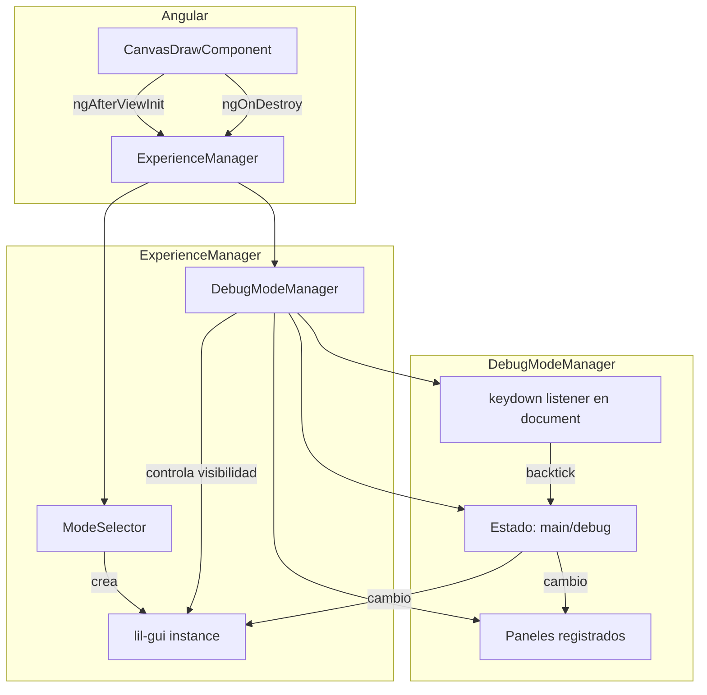
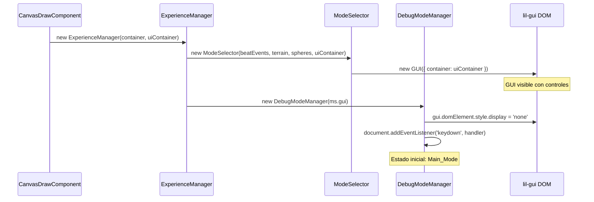
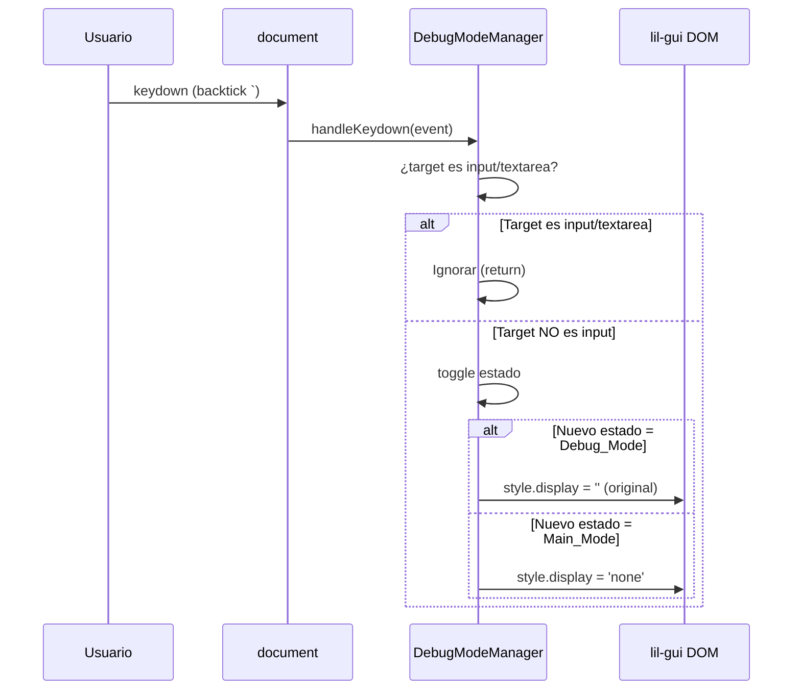

# Documento de Diseño: Debug Mode Toggle

## Overview

Este diseño describe un sistema de toggle entre dos modos de visualización para la experiencia 3D: un **modo principal** limpio (sin controles visibles) y un **modo debug** que expone el panel lil-gui existente. La implementación se centra en un módulo independiente (`DebugModeManager`) que gestiona la visibilidad del panel mediante CSS puro, sin destruir ni recrear la instancia de lil-gui, garantizando cero impacto en el rendimiento WebGL.

### Decisiones clave

| Decisión | Justificación |
|----------|---------------|
| `DebugModeManager` como módulo JS independiente | Separación de responsabilidades; el ModeSelector no necesita saber sobre modos de visibilidad |
| Ocultar con `display: none` en vez de destruir/recrear | Evita reflow costoso y preserva el estado de los controladores lil-gui |
| Listener en `document` fuera de NgZone | Un keydown en el document no debe disparar change detection de Angular (60fps loop ya está fuera) |
| Tecla backtick (`` ` ``) como toggle key | No colisiona con atajos comunes del navegador; accesible con una mano |
| Protección contra inputs con foco | lil-gui crea `<input>` internos para editar valores numéricos — el backtick podría escribirse ahí |
| Método `registerPanel()` para escalabilidad | Permite añadir nuevos paneles de debug (e.g., stats.js, postprocessing) sin modificar el manager |
| GUI se crea siempre pero empieza oculto | ModeSelector construye el GUI normalmente; DebugModeManager lo oculta en su constructor |

## Architecture



### Flujo de inicialización



### Flujo de toggle



## Components and Interfaces

### 1. DebugModeManager (nuevo: `src/ui/DebugModeManager.js`)

Módulo que gestiona el estado del modo debug y coordina la visibilidad del panel GUI y paneles registrados.

```javascript
/**
 * DebugModeManager — Gestiona el toggle entre modo principal y modo debug.
 *
 * Controla la visibilidad del panel lil-gui mediante CSS (display: none/block)
 * sin destruir ni recrear la instancia. Registra un listener de teclado en
 * document para alternar con la tecla backtick.
 */
export class DebugModeManager {

    /**
     * @param {GUI} gui - Instancia de lil-gui creada por ModeSelector
     */
    constructor(gui) { ... }

    /** Alterna entre Main_Mode y Debug_Mode */
    toggle() { ... }

    /** Fuerza el modo debug visible */
    show() { ... }

    /** Fuerza el modo principal (panel oculto) */
    hide() { ... }

    /**
     * Registra un panel adicional que participa del ciclo show/hide.
     * @param {{ show: Function, hide: Function, dispose?: Function }} panel
     */
    registerPanel(panel) { ... }

    /** Remueve listener y limpia referencias */
    dispose() { ... }
}
```

**Interfaz pública:**

| Método | Parámetros | Descripción |
|--------|-----------|-------------|
| `constructor(gui)` | `GUI` instancia de lil-gui | Oculta el GUI, registra listener, inicia en Main_Mode |
| `toggle()` | — | Alterna el estado y actualiza visibilidad |
| `show()` | — | Fuerza Debug_Mode activo |
| `hide()` | — | Fuerza Main_Mode activo |
| `registerPanel(panel)` | Objeto con `show()`, `hide()`, `dispose?()` | Añade un panel al ciclo de visibilidad |
| `dispose()` | — | Remueve listener de document, llama dispose en paneles registrados |

**Estado interno:**

```javascript
{
    _gui: GUI,              // Referencia a la instancia lil-gui (nunca se reasigna)
    _debugActive: false,    // true = Debug_Mode, false = Main_Mode
    _panels: [],            // Paneles registrados con registerPanel()
    _handler: Function,     // Referencia al handler de keydown (para removeEventListener)
    _originalDisplay: ''    // Valor original de display del GUI (capturado al construir)
}
```

### 2. ModeSelector (modificado: `src/ui/ModeSelector.js`)

**Cambios mínimos:**
- El GUI ya no necesita cambios de visibilidad propios — eso lo maneja DebugModeManager
- Se expone `this.gui` como propiedad pública (ya lo está)

```javascript
// Sin cambios funcionales. El GUI se crea visible como siempre.
// DebugModeManager lo ocultará inmediatamente después de la construcción.
```

### 3. ExperienceManager (modificado: `src/ExperienceManager.js`)

**Cambios:**
- Importar `DebugModeManager`
- Instanciar `DebugModeManager` pasándole `this.modeSelector.gui`
- Llamar `this.debugModeManager.dispose()` en el método `dispose()`

```javascript
import { DebugModeManager } from './ui/DebugModeManager.js';

// En el constructor, después de crear ModeSelector:
this.modeSelector = new ModeSelector(this.beatEvents, this.terrain, this.spheres, this.uiContainer);
this.debugModeManager = new DebugModeManager(this.modeSelector.gui);

// En dispose():
this.debugModeManager.dispose();
this.debugModeManager = null;
```

## Data Models

### Estado del DebugModeManager

El módulo mantiene un estado binario simple:

```javascript
// Solo dos estados posibles, representados como boolean
_debugActive: boolean  // false = Main_Mode (default), true = Debug_Mode
```

### Contrato de un panel registrado

Cualquier objeto que implemente esta interfaz puede registrarse:

```javascript
/**
 * @typedef {Object} DebugPanel
 * @property {Function} show - Hace visible el panel
 * @property {Function} hide - Oculta el panel
 * @property {Function} [dispose] - Limpieza opcional al destruir el manager
 */
```

### Teclas reconocidas

```javascript
// La Toggle_Key se identifica por event.key
const TOGGLE_KEY = '`';  // Backtick / grave accent
```

### Elementos protegidos (no toggle cuando tienen foco)

```javascript
// Elementos que bloquean el toggle cuando están enfocados
const BLOCKED_TAGS = ['INPUT', 'TEXTAREA', 'SELECT'];
// También elementos con contentEditable = 'true'
```

## Correctness Properties

*Una propiedad es una característica o comportamiento que debe mantenerse verdadero en todas las ejecuciones válidas de un sistema — esencialmente, una declaración formal sobre lo que el sistema debe hacer. Las propiedades sirven como puente entre especificaciones legibles por humanos y garantías de corrección verificables por máquina.*

### Property 1: Toggle alterna estado correctamente

*Para cualquier* número N de invocaciones consecutivas de `toggle()` sobre un DebugModeManager recién creado, el estado `_debugActive` debe ser `true` si N es impar, y `false` si N es par.

**Validates: Requirements 3.1**

### Property 2: Visibilidad del panel es consistente con el modo activo

*Para cualquier* secuencia de operaciones (toggle, show, hide) aplicadas a un DebugModeManager, el valor de `gui.domElement.style.display` debe ser `'none'` cuando `_debugActive` es `false`, y distinto de `'none'` cuando `_debugActive` es `true`.

**Validates: Requirements 1.1, 1.2, 2.1, 3.2, 3.3**

### Property 3: Toggle se ignora cuando un input tiene foco

*Para cualquier* evento `keydown` de la tecla backtick cuyo `event.target` sea un elemento `INPUT`, `TEXTAREA`, `SELECT` o un elemento con `contentEditable`, el estado `_debugActive` del DebugModeManager no debe cambiar.

**Validates: Requirements 3.4**

### Property 4: La referencia al GUI se preserva tras toggles

*Para cualquier* secuencia de N toggles (N ≥ 0), la referencia `_gui` del DebugModeManager debe ser estrictamente igual (`===`) a la instancia de GUI pasada en el constructor.

**Validates: Requirements 4.2**

### Property 5: Dispose remueve el listener de keydown

*Para cualquier* DebugModeManager instanciado y posteriormente disposed, disparar un evento `keydown` con la tecla backtick en `document` no debe modificar el estado interno del manager ni la visibilidad del panel.

**Validates: Requirements 5.2**

### Property 6: registerPanel integra paneles al ciclo de toggle

*Para cualquier* panel registrado mediante `registerPanel()` que implemente `show()` y `hide()`, al invocar `toggle()` el panel registrado debe recibir la misma llamada (`show` o `hide`) que corresponda al nuevo estado del manager.

**Validates: Requirements 6.2, 6.5**

## Error Handling

### Errores de inicialización

| Escenario | Estrategia |
|-----------|------------|
| `gui` es `null` o `undefined` | Lanzar error descriptivo en el constructor: `"DebugModeManager requiere una instancia de GUI válida"` |
| `gui.domElement` no existe | Lanzar error: `"La instancia de GUI no tiene domElement montado"` |
| `document` no disponible (SSR) | Guard clause: si `typeof document === 'undefined'`, no registrar listener |

### Errores en runtime

| Escenario | Estrategia |
|-----------|------------|
| Panel registrado sin método `show`/`hide` | Validar en `registerPanel()`; lanzar TypeError si falta la interfaz |
| `toggle()` llamado después de `dispose()` | Guard clause: si `_handler` es null, retornar sin hacer nada |
| Error en un panel registrado durante show/hide | Envolver cada llamada a panel en try/catch para no afectar otros paneles ni el GUI principal |

### Cleanup

| Escenario | Estrategia |
|-----------|------------|
| `dispose()` llamado múltiples veces | Idempotente: verificar que `_handler` no es null antes de remover |
| Panel registrado lanza error en `dispose()` | try/catch individual por panel; continuar con los demás |

## Testing Strategy

### Unit Tests (Vitest)

Tests de ejemplo y edge cases:

- **Estado inicial**: verificar que `_debugActive` es `false` tras construcción
- **Display inicial**: verificar que `gui.domElement.style.display` es `'none'` tras construcción
- **Toggle simple**: Main → Debug → Main verifica transición correcta
- **show() / hide()**: verificar que fuerzan el estado independientemente del estado actual
- **Protección de inputs**: simular keydown con target=INPUT, verificar que no cambia estado
- **dispose() limpia listener**: tras dispose, keydown no altera el estado
- **registerPanel**: verificar que show/hide se llaman en paneles registrados
- **Panel con error**: registrar panel cuyo `show()` lanza error, verificar que el GUI sigue funcionando
- **Constructor con GUI inválido**: verificar que lanza error descriptivo

### Property-Based Tests (fast-check)

Biblioteca: **fast-check** (consistente con el spec `threejs-angular-integration`).

Configuración: mínimo 100 iteraciones por propiedad.

```javascript
// Formato de tags:
// Feature: debug-mode-toggle, Property {N}: {texto}
```

**Propiedades a implementar:**

1. **Toggle alterna estado** — Generar N aleatorio en [0, 200], aplicar N toggles, verificar estado final.
   - Tag: `Feature: debug-mode-toggle, Property 1: Toggle alterna estado correctamente`

2. **Visibilidad consistente con modo** — Generar secuencia aleatoria de operaciones (toggle/show/hide), verificar display tras cada una.
   - Tag: `Feature: debug-mode-toggle, Property 2: Visibilidad del panel es consistente con el modo activo`

3. **Protección contra inputs** — Generar eventos con targets aleatorios (INPUT, TEXTAREA, SELECT, DIV, SPAN), verificar que solo los no-input togglean.
   - Tag: `Feature: debug-mode-toggle, Property 3: Toggle se ignora cuando un input tiene foco`

4. **Referencia GUI preservada** — Generar secuencia de N toggles, verificar `===` con GUI original.
   - Tag: `Feature: debug-mode-toggle, Property 4: La referencia al GUI se preserva tras toggles`

5. **Dispose remueve listener** — Instanciar, dispose, generar N keydowns, verificar estado inmutable.
   - Tag: `Feature: debug-mode-toggle, Property 5: Dispose remueve el listener de keydown`

6. **registerPanel integra paneles** — Generar M paneles con spies, registrarlos, aplicar N toggles, verificar que cada panel recibió las mismas llamadas show/hide que el GUI.
   - Tag: `Feature: debug-mode-toggle, Property 6: registerPanel integra paneles al ciclo de toggle`

### Integration Tests

- **Lifecycle completo con ExperienceManager**: verificar que la experiencia arranca en Main_Mode, toggle funciona, y dispose limpia todo
- **Interacción con lil-gui**: en Debug_Mode, modificar un control y verificar que el onChange se dispara
- **NgZone isolation**: verificar que el keydown listener no dispara change detection
