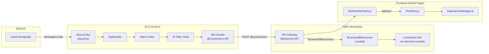
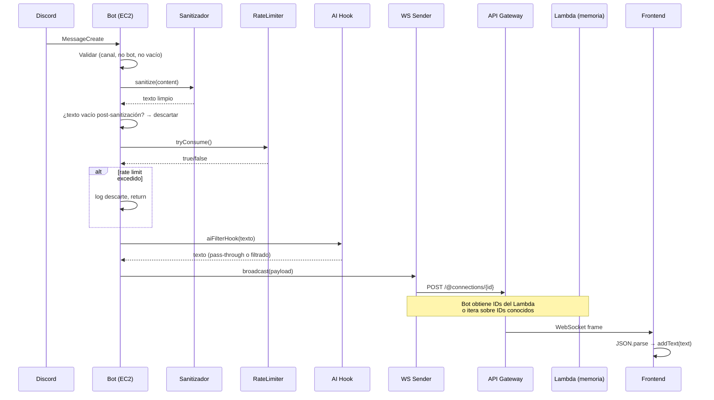
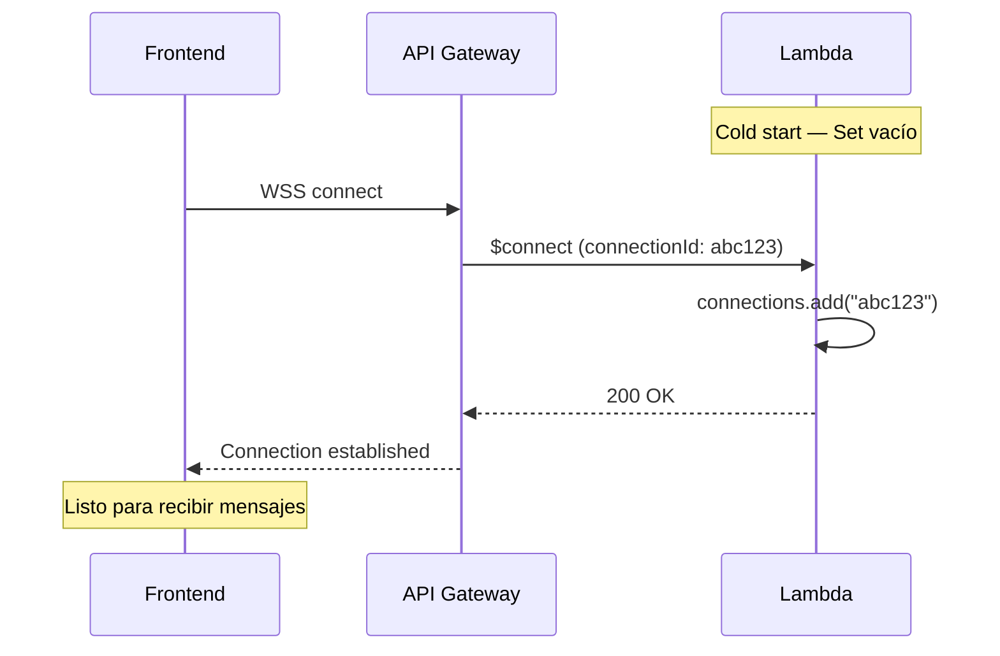

# Diseño Técnico — Discord 3D Messages

## Overview

Esta feature conecta un canal de Discord con la experiencia 3D existente (Three.js/Angular) para que los mensajes escritos por personas aparezcan como textos 3D flotantes en tiempo real.

### Flujo de datos

```
Canal Discord → Bot discord.js (EC2 t3.micro) → API Gateway WebSocket API → Frontend Angular (WSS) → PixelText queue → texto 3D
                                                         ↓ (hook futuro)
                                                  Bedrock/Comprehend
```

### Principios de diseño

1. **Costo $0**: Todo dentro del free tier de AWS (EC2, API Gateway, Lambda).
2. **Simplicidad**: Mínimos servicios AWS = menos configuración = menos que puede fallar.
3. **Resiliencia**: Fallos puntuales no rompen ni el bot ni la experiencia visual.
4. **Extensibilidad**: Hook para IA preparado pero no implementado.
5. **Sanitización en origen**: El backend limpia el texto antes de transmitir, evitando desperdiciar mensajes WebSocket con contenido no renderizable.

## Architecture



### Decisiones arquitectónicas

| Decisión | Razón |
|----------|-------|
| Bot envía directamente vía Management API (@connections) | Evita un Lambda intermedio por mensaje. Solo Lambda para $connect/$disconnect. |
| Connection IDs en memoria (variable global del Lambda) | Para un hackathon con pocos clientes es suficiente. Sin DynamoDB = menos servicios, menos configuración, $0 extra. Si el Lambda se enfría los IDs se pierden, pero los clientes se reconectan automáticamente con exponential backoff. |
| Sanitización en backend | No desperdicia mensajes WS con texto no renderizable. Reduce bytes transmitidos. |
| Exponential backoff en frontend | API Gateway cierra conexiones a las 2h. El frontend debe reconectarse sin spam. Además compensa la pérdida de IDs si el Lambda se reinicia. |
| No usar Lambda por cada mensaje | El bot ya está corriendo 24/7 en EC2 — agregar un Lambda sería overhead innecesario. |
| Username en payload pero no renderizado | Se transmite para futuras implementaciones (mostrar quién escribió). Por ahora el frontend solo usa `text` para PixelText. |

### Recursos AWS totales

| Recurso | Detalle | Costo |
|---------|---------|-------|
| API Gateway WebSocket API | Routes: $connect, $disconnect, sendMessage | Free tier (~1M mensajes/mes) |
| Lambda (1 función) | Maneja connect/disconnect, IDs en memoria | Free tier (1M invocaciones/mes) |
| EC2 t3.micro | Bot Discord 24/7 | Free tier (750h/mes primer año) |
| **Total** | | **$0** |

## Components and Interfaces

### 1. Backend — `backend/src/modules/discordToWs.ts`

Módulo principal que orquesta el pipeline de captura → sanitización → rate limit → AI hook → envío WS.

```typescript
// Interfaz pública del módulo
interface DiscordToWsOptions {
  client: Client;
  wsApiEndpoint: string;    // URL del API Gateway Management API
  channelId: string;         // ID del canal designado
  rateLimitConfig: RateLimitConfig;
  aiFilterHook?: AiFilterHook;
}

function discordToWs(options: DiscordToWsOptions): void;
```

### 2. Backend — `backend/src/modules/sanitizer.ts`

Función pura que transforma texto crudo en texto renderizable por el bitmap font.

```typescript
interface SanitizerConfig {
  maxLength: number;
  supportedChars: Set<number>;  // Char codes del .fnt
}

function sanitize(input: string, config: SanitizerConfig): string;
```

**Pipeline de sanitización** (orden crítico):
1. `toUpperCase()` — el bitmap font es uppercase-only
2. Filtrar caracteres no soportados (solo los que están en el set del .fnt)
3. `trim()` — eliminar espacios al inicio/final
4. Truncar a `maxLength`

### 3. Backend — `backend/src/modules/rateLimiter.ts`

Token bucket para controlar la tasa de mensajes transmitidos.

```typescript
interface RateLimitConfig {
  maxTokens: number;      // Mensajes máximos por ventana
  refillRate: number;     // Tokens que se recargan por segundo
  windowMs: number;       // Ventana de tiempo en ms
}

class RateLimiter {
  tryConsume(): boolean;   // true = permitido, false = descartado
  reset(): void;
}
```

### 4. Backend — `backend/src/modules/aiFilterHook.ts`

Punto de extensión para filtrado por IA. Implementación por defecto: pass-through.

```typescript
type AiFilterHook = (text: string) => Promise<string>;

// Implementación por defecto
const passthroughFilter: AiFilterHook = async (text) => text;
```

### 5. Backend — `backend/src/modules/wsSender.ts`

Envía payloads a todos los clientes conectados vía API Gateway Management API.

```typescript
interface WsSenderConfig {
  apiEndpoint: string;  // https://{api-id}.execute-api.{region}.amazonaws.com/{stage}
}

class WsSender {
  constructor(config: WsSenderConfig);
  broadcast(payload: MessagePayload): Promise<void>;
  // Llama al Lambda para obtener connection IDs activos, envía a cada uno
  // Si un connectionId está stale (410 Gone), lo ignora
}
```

### 6. Frontend — `src/services/WebSocketClient.js`

Cliente WSS con reconexión automática y exponential backoff.

```javascript
class WebSocketClient {
  constructor(endpoint, onMessage)
  connect()
  disconnect()
  // Privados:
  // _reconnect() — exponential backoff: 1s, 2s, 4s, 8s... max 30s
  // _onMessage(event) — parsea JSON, llama onMessage(payload)
}
```

### 7. AWS Lambda — `infra/lambda/connect.js`

Handler para $connect, $disconnect y sendMessage. Almacena connection IDs en una variable global (Set) en memoria del Lambda.

```javascript
// Variable global — persiste mientras el Lambda esté "caliente"
const connections = new Set();

exports.handler = async (event) => {
  const connectionId = event.requestContext.connectionId;
  const routeKey = event.requestContext.routeKey;

  switch (routeKey) {
    case '$connect':
      connections.add(connectionId);
      break;
    case '$disconnect':
      connections.delete(connectionId);
      break;
    case 'sendMessage':
      // Retorna la lista de connection IDs activos para broadcast
      // O directamente hace el broadcast desde aquí
      break;
  }

  return { statusCode: 200, body: 'OK' };
};
```

**Nota sobre cold starts**: Cuando el Lambda se enfría (típicamente tras ~15 min sin invocaciones), el Set se vacía. Los clientes frontend detectan la conexión perdida (o no reciben mensajes) y se reconectan automáticamente, re-registrando su connectionId. Para un hackathon con pocos usuarios concurrentes esto es aceptable.

### 8. Infraestructura — `infra/template.yaml` (AWS SAM)

Plantilla CloudFormation/SAM que define:
- API Gateway WebSocket API (routes: $connect, $disconnect, sendMessage)
- Lambda function (Node.js 20.x, 128MB RAM)
- IAM roles mínimos (solo execute-api:ManageConnections)

**Sin DynamoDB, sin tablas, sin permisos de DB.**

### Interacción entre componentes



### Flujo de reconexión (compensa pérdida de IDs en cold start)



## Data Models

### Message Payload (transmitido por WebSocket)

```typescript
interface MessagePayload {
  type: 'message';
  text: string;        // Texto sanitizado, uppercase, solo chars soportados
  username: string;    // Nombre del usuario de Discord que escribió el mensaje
  timestamp: number;   // Unix timestamp ms
}
```

**Ejemplo:**
```json
{
  "type": "message",
  "text": "HOLA MUNDO",
  "username": "JuanCarlos",
  "timestamp": 1690000000000
}
```

**Nota**: El frontend recibe `username` pero por ahora solo usa `text` para PixelText. El campo `username` queda disponible para futuras implementaciones (mostrar quién escribió el mensaje, colores por usuario, etc.).

### Connection IDs — Variable global en Lambda

```javascript
// No hay tabla de base de datos.
// Los IDs viven en memoria mientras el Lambda está caliente.
const connections = new Set();  // Set<string>
```

| Aspecto | Detalle |
|---------|---------|
| Almacenamiento | Variable global (Set) en el runtime del Lambda |
| Persistencia | Solo mientras el Lambda está caliente (~15 min sin uso) |
| Recuperación tras cold start | Los clientes se reconectan automáticamente (exponential backoff) |
| Escalabilidad | Suficiente para hackathon (< 50 clientes concurrentes) |

### Configuración del Backend (extensión del .env)

```env
# Discord 3D Messages
WS_API_ENDPOINT=https://xxxxxx.execute-api.us-east-1.amazonaws.com/prod
WS_CHANNEL_ID=123456789012345678
RATE_LIMIT_MAX=20
RATE_LIMIT_WINDOW_MS=60000
MAX_MESSAGE_LENGTH=50
```

### Configuración del Frontend

```javascript
// src/Config.js — nueva sección
websocket: {
  endpoint: 'wss://xxxxxx.execute-api.us-east-1.amazonaws.com/prod',
  reconnect: {
    initialDelay: 1000,
    maxDelay: 30000,
    multiplier: 2
  }
}
```

## Correctness Properties

*Una propiedad es una característica o comportamiento que debe mantenerse verdadero en todas las ejecuciones válidas de un sistema — esencialmente, una declaración formal sobre lo que el sistema debe hacer. Las propiedades sirven como puente entre especificaciones legibles por humanos y garantías de corrección verificables por máquina.*

### Property 1: Invariante del sanitizador

*Para cualquier* string Unicode de entrada, el resultado del sanitizador SHALL ser una cadena compuesta únicamente por caracteres presentes en el set soportado del Bitmap_Font, con longitud ≤ maxLength, en uppercase, y sin whitespace al inicio ni al final.

**Validates: Requirements 6.1, 6.2, 6.3, 6.4, 6.5**

### Property 2: Serialización round-trip del payload

*Para cualquier* texto sanitizado válido y username válido, serializar un MessagePayload a JSON y luego deserializarlo SHALL producir un objeto equivalente cuyos campos `text`, `username` y `timestamp` sean idénticos a los valores originales.

**Validates: Requirements 2.2, 2.3, 3.3**

### Property 3: Filtrado de mensajes de bot

*Para cualquier* mensaje donde `author.bot === true`, el pipeline SHALL descartarlo sin transmitir payload alguno al WebSocket_Bridge, independientemente del contenido o canal.

**Validates: Requirements 1.2, 8.2**

### Property 4: Filtrado por canal

*Para cualquier* mensaje cuyo `channelId` sea distinto al Canal_Designado configurado, el pipeline SHALL descartarlo sin transmitir payload alguno.

**Validates: Requirements 1.3**

### Property 5: Filtrado de contenido vacío

*Para cualquier* mensaje cuyo contenido de texto, tras eliminar whitespace, sea una cadena vacía, el pipeline SHALL descartarlo tanto en el backend (pre-sanitización) como en el frontend (post-sanitización) sin encolarlo en PixelText_Queue.

**Validates: Requirements 1.5, 5.3**

### Property 6: Rate limiter respeta la ventana

*Para cualquier* secuencia de N mensajes en una ventana de tiempo T, donde N > maxTokens, el Rate_Limiter SHALL permitir como máximo `maxTokens` mensajes y descartar el resto.

**Validates: Requirements 8.1, 8.3**

### Property 7: AI Filter Hook identity

*Para cualquier* string de entrada, cuando no hay filtro de IA configurado, el AI_Filter_Hook SHALL devolver exactamente el mismo string de entrada sin modificación.

**Validates: Requirements 7.2**

### Property 8: Frontend descarta JSON inválido

*Para cualquier* string que no sea JSON válido recibido por el Frontend_Client, el cliente SHALL descartarlo sin llamar addText() y sin cerrar la conexión WebSocket.

**Validates: Requirements 3.4, 10.2**

### Property 9: Exponential backoff del frontend

*Para cualquier* secuencia de N reconexiones fallidas consecutivas, el delay antes del intento N SHALL ser `min(initialDelay × 2^(N-1), maxDelay)`.

**Validates: Requirements 4.2**

### Property 10: Resiliencia ante errores individuales

*Para cualquier* mensaje que cause un error durante su procesamiento, el Discord_Bot SHALL continuar escuchando y procesando mensajes posteriores sin interrumpir el servicio.

**Validates: Requirements 10.1, 2.5**

### Property 11: Validación de configuración al arranque

*Para cualquier* combinación de variables de entorno donde al menos una variable requerida (WS_API_ENDPOINT, WS_CHANNEL_ID, token) esté ausente, el Discord_Bot SHALL lanzar un error descriptivo y detener el arranque.

**Validates: Requirements 9.3**

## Error Handling

### Backend (Discord Bot)

| Escenario | Acción |
|-----------|--------|
| Error en procesamiento de un mensaje individual | Log del error, continuar con el siguiente mensaje |
| Fallo al enviar al WS Bridge (connection stale / 410 Gone) | Ignorar ese connectionId, continuar con otros |
| Fallo al enviar al WS Bridge (timeout/network) | Log, reintentar 1 vez, luego continuar |
| WS Bridge no disponible (todas las conexiones fallan) | Log warning, continuar capturando (los mensajes se pierden) |
| Variable de entorno faltante | Error descriptivo + process.exit(1) al arranque |
| Rate limit excedido | Log info del descarte, no transmitir |

### Frontend (WebSocketClient)

| Escenario | Acción |
|-----------|--------|
| Conexión WSS cerrada inesperadamente | Iniciar reconexión con exponential backoff |
| Conexión WSS cerrada por timeout (2h) | Reconectar inmediatamente (es esperado) |
| Conexión WSS no recibe mensajes (posible cold start del Lambda) | El frontend no detecta esto directamente — la reconexión periódica natural lo resuelve |
| Mensaje recibido no es JSON válido | Log warning, descartar, mantener conexión |
| Mensaje JSON sin campo `text` | Log warning, descartar |
| Error en addText() | Log error, no cerrar conexión, continuar |

### AWS Lambda (connect/disconnect)

| Escenario | Acción |
|-----------|--------|
| Cold start (Set vacío) | Los clientes se reconectan automáticamente y vuelven a registrarse |
| ConnectionId duplicado en $connect | Set ya lo maneja (no duplica) |
| $disconnect de un ID que no existe en el Set | `Set.delete()` no lanza error, no-op |

### Estrategia general

- **Fail-open para el frontend**: Si algo falla, la experiencia 3D sigue corriendo. Solo se dejan de mostrar mensajes nuevos.
- **Fail-safe para el backend**: Si algo falla en el pipeline, el bot sigue escuchando. Los mensajes individuales se pierden, no el servicio.
- **No hay retry queue**: Los mensajes de Discord son efímeros. Si uno falla, se pierde. No vale la pena complejizar con colas.
- **Reconexión como mecanismo de recovery**: El exponential backoff del frontend es la respuesta tanto a desconexiones de red como a cold starts del Lambda.

## Testing Strategy

### Testing por capas

#### 1. Unit Tests (ejemplo-based) — Backend

- **Sanitizador**: Casos concretos con emojis, caracteres especiales, strings vacíos, strings muy largos
- **Rate Limiter**: Verificar que permite N mensajes y bloquea el N+1
- **AI Filter Hook**: Verificar pass-through y mock de filtro
- **Config validation**: Verificar que falla con variables faltantes
- **Pipeline filtering**: Mensajes de bots, canal incorrecto, contenido vacío
- **Username extraction**: Verificar que se extrae `message.author.username` correctamente

#### 2. Unit Tests (ejemplo-based) — Frontend

- **WebSocketClient**: Reconexión tras cierre, parseo de payloads, descarte de JSON inválido
- **Integración con PixelText**: Verificar que addText se llama con el campo `text` del payload

#### 3. Property-Based Tests

Librería: **fast-check** (TypeScript/JavaScript, bien integrada con el ecosistema Node.js).

Configuración: mínimo 100 iteraciones por propiedad.

Cada test referencia su propiedad del diseño con el tag:
```
// Feature: discord-3d-messages, Property N: <título>
```

**Tests de propiedad a implementar:**

| # | Propiedad | Generador |
|---|-----------|-----------|
| 1 | Sanitizador invariante | `fc.string()` (Unicode completo) |
| 2 | Serialización round-trip | `fc.record({ text: fc.string(), username: fc.string(), timestamp: fc.nat() })` |
| 3 | Filtrado de bots | `fc.record({ bot: fc.constant(true), content: fc.string() })` |
| 4 | Filtrado por canal | `fc.string()` para channelId ≠ configurado |
| 5 | Filtrado de vacíos | `fc.stringOf(fc.constantFrom(' ', '\t', '\n', '\r'))` |
| 6 | Rate limiter | `fc.nat({ max: 100 })` para cantidad de mensajes |
| 7 | AI hook identity | `fc.string()` |
| 8 | Frontend descarta JSON inválido | `fc.string().filter(s => { try { JSON.parse(s); return false } catch { return true } })` |
| 9 | Exponential backoff | `fc.nat({ min: 1, max: 20 })` para cantidad de reintentos |
| 10 | Resiliencia ante errores | `fc.string()` con error inyectado aleatoriamente |
| 11 | Config validation | `fc.subset(['WS_API_ENDPOINT', 'WS_CHANNEL_ID', 'token'])` para vars faltantes |

#### 4. Integration Tests

- **E2E local**: Bot → API Gateway (staging) → Frontend — verificar que un mensaje llega como texto 3D
- **Lambda**: Deploy en staging, verificar $connect/$disconnect registra/limpia IDs en memoria
- **WebSocket Management API**: Verificar broadcast a múltiples conexiones
- **Cold start recovery**: Verificar que tras reinicio del Lambda, los clientes se reconectan y re-registran

### Estructura de archivos de test

```
backend/
  tests/
    unit/
      sanitizer.test.ts
      rateLimiter.test.ts
      aiFilterHook.test.ts
      configValidation.test.ts
    property/
      sanitizer.property.ts
      rateLimiter.property.ts
      pipeline.property.ts
      payload.property.ts
    integration/
      wsSender.integration.ts

src/
  tests/
    unit/
      WebSocketClient.test.js
    property/
      WebSocketClient.property.js
      backoff.property.js
```

### Costos de testing

- Todos los property tests son **in-memory** con mocks — $0.
- Integration tests contra API Gateway solo se corren manualmente o en CI con un stage de staging.
- No se necesitan recursos AWS para unit/property tests.
