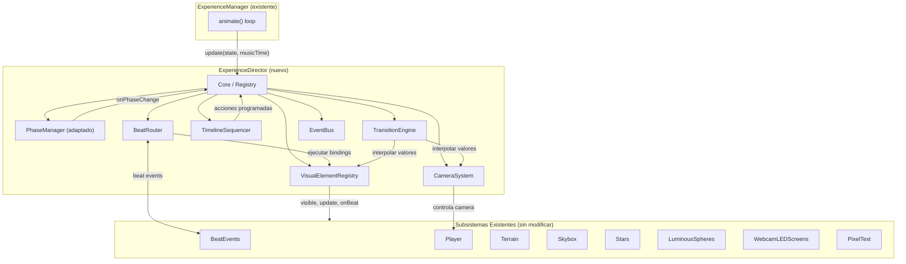
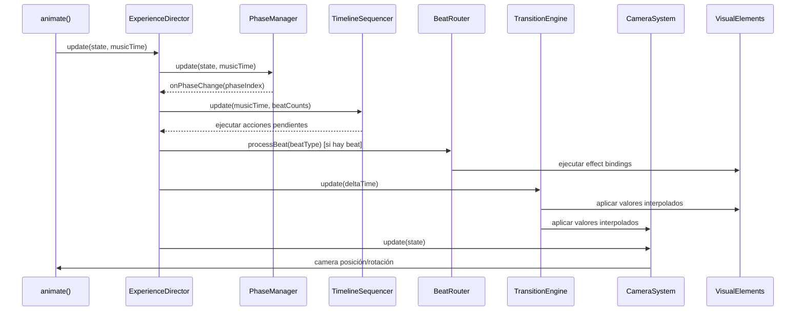
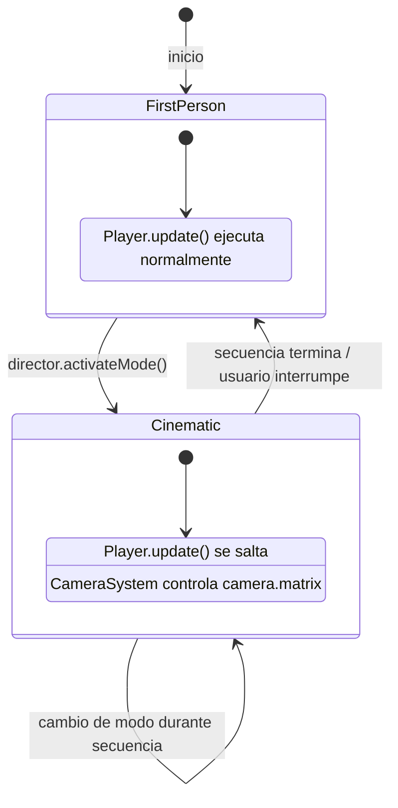

# Documento de Diseño — Experience Director

## Overview

El Experience Director es una capa de orquestación que se interpone entre el ExperienceManager existente y los subsistemas visuales (Terrain/BeatEvents, LuminousSpheres, Stars, Skybox, WebcamLEDScreens, PixelText, Player). Su responsabilidad es coordinar QUÉ combinación de efectos está activa en cada momento, basándose en tres fuentes de control:

1. **PhaseManager** — cambios de fase por timestamps de la canción
2. **Beat Router** — respuestas visuales a beats detectados
3. **Timeline Sequencer** — eventos programados declarativamente

El sistema se diseña como módulo ES independiente que el ExperienceManager instancia e invoca en su loop de animación, sin modificar la lógica interna de ningún subsistema existente.

### Principios de Diseño

- **No-destructivo**: Toda la configuración actual (cinematic mode, 6 terrain modes, 7 light patterns, bloom, skybox HSL cycle) se preserva como preset "default"
- **Registro explícito**: Camera Modes, Visual Elements y Mood Presets se añaden mediante métodos `register*`
- **Observador**: Los cambios de estado se comunican via eventos (patrón pub/sub interno)
- **Interpolación por defecto**: Todo cambio de configuración numérica pasa por el Transition Engine

---

## Architecture

### Diagrama de Módulos



### Flujo de Datos por Frame



---

## Components and Interfaces

### 1. ExperienceDirector (Core)

Módulo principal que coordina todos los subsistemas del director. Se instancia una vez desde ExperienceManager.

```typescript
// Interfaz conceptual (implementación en JS vanilla)
interface ExperienceDirector {
  // Ciclo de vida
  constructor(dependencies: DirectorDependencies)
  update(state: FrameState, musicTime: number): void
  dispose(): void

  // Registro
  registerPreset(name: string, config: MoodPresetConfig): void
  registerCameraMode(name: string, handler: CameraModeHandler): void
  registerElement(name: string, element: VisualElementAdapter): void

  // Control
  activatePreset(name: string, transitionDuration?: number): void
  setElementActive(elementName: string, active: boolean): void
  getElementState(elementName: string): boolean
  previewSequence(sequenceConfig: CameraSequenceConfig): void

  // Serialización
  exportConfig(): ExportedConfig
  importConfig(json: ExportedConfig): { success: boolean, errors?: string[] }

  // Eventos
  on(event: string, callback: Function): void
  off(event: string, callback: Function): void
}
```

**Dependencias inyectadas:**
```javascript
{
  player,          // Player existente
  beatEvents,      // BeatEvents existente
  terrain,         // Terrain existente
  skybox,          // Skybox existente
  stars,           // Stars existente
  spheres,         // LuminousSpheres existente
  webcamScreens,   // WebcamLEDScreens existente
  pixelText,       // PixelText existente
  view,            // View (para bloomPass)
  music            // MusicPlayer (para musicTime)
}
```

### 2. PhaseManager (adaptado)

Se refactoriza el PhaseManager existente para que notifique al ExperienceDirector en lugar de controlar subsistemas directamente. La lógica actual de `applyConfig()` se convierte en activaciones de Mood Presets.

```typescript
interface PhaseManager {
  constructor(onPhaseChange: (phaseIndex: number) => void)
  update(state: FrameState, musicTime: number): void

  // API de triggers en runtime
  addTrigger(time: number, phaseIndex: number): boolean
  removeTrigger(time: number): boolean
  reorderTriggers(): void
  getTriggers(): PhaseTrigger[]

  // Soporte de seek
  recalculatePhase(musicTime: number): void
}
```

**Decisión de diseño**: El PhaseManager NO conoce los Mood Presets. Solo notifica índices de fase al ExperienceDirector, que mantiene la tabla de asociación `phaseIndex → presetName`.

### 3. BeatRouter

Mapea tipos de beat a respuestas visuales configurables.

```typescript
interface BeatRouter {
  constructor(beatEvents: BeatEvents, elementRegistry: VisualElementRegistry)
  
  // Configuración
  addBinding(beatType: BeatType, binding: EffectBinding): void
  removeBinding(beatType: BeatType, elementName: string): void
  replaceBindings(beatType: BeatType, bindings: EffectBinding[]): void
  getBindings(beatType: BeatType): EffectBinding[]

  // Ejecución — llamado por ExperienceDirector cuando detecta beat
  processBeat(beatType: BeatType): void
}
```

**Integración con BeatEvents**: El ExperienceDirector lee `beatEvents.beatTriggered`, `beatEvents.midBeatTriggered`, `beatEvents.highBeatTriggered` cada frame y delega al BeatRouter. No se modifica BeatEvents.

### 4. TransitionEngine

Interpola suavemente entre configuraciones numéricas y de color.

```typescript
interface TransitionEngine {
  constructor()
  update(deltaTime: number): void

  // Iniciar transición
  startTransition(config: TransitionConfig): void

  // Estado
  isTransitioning(): boolean
  getCurrentValues(): Record<string, number | THREE.Color>

  // Callback
  onComplete: (() => void) | null
}

interface TransitionConfig {
  from: Record<string, number | string>  // valores actuales
  to: Record<string, number | string>    // valores destino
  duration: number                        // 0.1 a 10 segundos
  easing: 'linear' | 'easeInOut' | 'easeIn' | 'easeOut'
  immediateKeys?: string[]               // claves no interpolables (terrainMode, pattern)
}
```

**Decisión de diseño**: Los colores se interpolan en espacio HSL para evitar tonos grises intermedios. Los parámetros discretos (terrainMode, lightPattern) se aplican inmediatamente al inicio de la transición.

### 5. CameraSystem

Gestiona los 8 modos de cámara y las secuencias programadas.

```typescript
interface CameraSystem {
  constructor(player: Player, camera: THREE.PerspectiveCamera)
  update(state: FrameState): void

  // Control
  activateMode(mode: CameraModeName, params: CameraModeParams, duration: number): void
  stopSequence(transitionDuration?: number): void
  playPlaylist(sequences: CameraSequenceEntry[], options?: PlaylistOptions): void
  previewSequence(config: CameraSequenceConfig): void

  // Estado
  isSequenceActive(): boolean
  getCurrentMode(): CameraModeName

  // Interrupción por usuario
  enableUserInterrupt(key?: string): void
  disableUserInterrupt(): void
}

type CameraModeName = 'first-person' | 'orbit' | 'dolly' | 'crane' 
                     | 'tracking' | 'flyby' | 'shake' | 'static'
```

**Decisión de diseño**: Cuando un Camera Mode cinematográfico está activo, el CameraSystem toma control de `camera.matrix` directamente (como ya hace Player). El Player se "duerme" (su `update()` se salta). Al finalizar la secuencia, se interpola de vuelta a la posición/orientación que tendría el Player.

### 6. VisualElementRegistry

Registro y control de activación/desactivación de elementos visuales.

```typescript
interface VisualElementRegistry {
  register(name: string, adapter: VisualElementAdapter): void
  setActive(name: string, active: boolean): void
  isActive(name: string): boolean
  getAll(): Map<string, { adapter: VisualElementAdapter, active: boolean }>
  getNames(): string[]
}

// Adaptador que envuelve cada subsistema existente
interface VisualElementAdapter {
  name: string
  setVisible(visible: boolean): void
  update(state: FrameState): void    // solo se llama si activo
  onBeat?(beatType: BeatType, intensity: number): void
  getSceneObject(): THREE.Object3D   // para .visible
}
```

**Decisión de diseño**: Se crean adaptadores ligeros para cada subsistema (StarsAdapter, SpheresAdapter, etc.) que implementan la interfaz. Los subsistemas no se modifican; el adaptador simplemente controla `.visible` y condiciona la llamada a `update()`.

### 7. TimelineSequencer

Programa eventos por tiempo absoluto, conteo de beats, o triggers compuestos.

```typescript
interface TimelineSequencer {
  constructor(director: ExperienceDirector)
  update(musicTime: number, beatCounts: BeatCounts): void

  // Configuración
  loadEvents(events: TimelineEvent[]): void
  getEvents(): TimelineEvent[]

  // Control
  pause(): void
  resume(): void
  isPaused(): boolean
}
```

### 8. EventBus

Sistema de eventos interno del Experience Director.

```typescript
interface EventBus {
  emit(event: string, data: EventData): void
  on(event: string, handler: Function): () => void  // retorna unsubscribe
  off(event: string, handler: Function): void
}

// Eventos emitidos:
// 'phaseChange'       → { phaseIndex, presetName, timestamp }
// 'transitionStart'   → { fromPreset, toPreset, duration, timestamp }
// 'transitionEnd'     → { presetName, timestamp }
// 'sequenceStart'     → { modeName, params, timestamp }
// 'sequenceEnd'       → { modeName, timestamp }
// 'elementToggle'     → { elementName, active, timestamp }
```

---

## Data Models

### MoodPresetConfig

```javascript
/**
 * Configuración completa de un Mood Preset.
 * Todos los campos son obligatorios al registrar.
 */
const MoodPresetConfig = {
  // Terreno
  terrainMode: 'spectrum',  // 'spectrum'|'spring'|'flat'|'still'|'steps'|'wave'

  // Esferas luminosas
  lightPattern: 'radialPulse',  // 'waveRow'|'diagonal'|'radialPulse'|'allFlash'|'snake'|'checker'|'off'

  // Bloom (View.bloomPass)
  bloom: {
    strength: 1.5,    // 0.0 - 5.0
    radius: 0.4,      // 0.0 - 2.0
    threshold: 0.4    // 0.0 - 1.0
  },

  // Skybox
  skybox: {
    hueRange: [0.6, 0.95],     // rango HSL del ciclo
    saturation: 0.8,
    baseLightness: 0.04,
    pulseIntensity: 0.12
  },

  // Cámara
  camera: {
    mode: 'first-person',   // CameraModeName
    params: {}              // parámetros específicos del modo
  }
}
```

### Presets Predefinidos

```javascript
const BUILT_IN_PRESETS = {
  // Preserva el comportamiento actual exacto del ExperienceManager
  'default': {
    terrainMode: 'spectrum',
    lightPattern: 'radialPulse',
    bloom: { strength: 1.5, radius: 0.4, threshold: 0.4 },
    skybox: { hueRange: [0.6, 0.95], saturation: 0.8, baseLightness: 0.04, pulseIntensity: 0.12 },
    camera: { mode: 'first-person', params: { velocity: 150, altitude: 60, targetDistance: 150, fov: 30 } }
  },

  'energético': {
    terrainMode: 'spectrum',
    lightPattern: 'allFlash',
    bloom: { strength: 2.5, radius: 0.6, threshold: 0.2 },
    skybox: { hueRange: [0.0, 0.15], saturation: 1.0, baseLightness: 0.08, pulseIntensity: 0.25 },
    camera: { mode: 'first-person', params: { velocity: 300, altitude: 40, targetDistance: 100, fov: 60 } }
  },

  'contemplativo': {
    terrainMode: 'wave',
    lightPattern: 'radialPulse',
    bloom: { strength: 1.0, radius: 0.8, threshold: 0.6 },
    skybox: { hueRange: [0.55, 0.7], saturation: 0.5, baseLightness: 0.02, pulseIntensity: 0.05 },
    camera: { mode: 'first-person', params: { velocity: 80, altitude: 100, targetDistance: 250, fov: 25 } }
  },

  'caótico': {
    terrainMode: 'spring',
    lightPattern: 'snake',
    bloom: { strength: 3.0, radius: 1.0, threshold: 0.1 },
    skybox: { hueRange: [0.0, 1.0], saturation: 1.0, baseLightness: 0.1, pulseIntensity: 0.3 },
    camera: { mode: 'first-person', params: { velocity: 250, altitude: 35, targetDistance: 80, fov: 75 } }
  }
}
```

### CameraSequenceConfig

```javascript
/**
 * Configuración para una secuencia de cámara.
 */
const CameraSequenceConfig = {
  mode: 'orbit',           // CameraModeName
  duration: 10.0,          // 0.1 - 300.0 segundos (obligatorio)
  beatSync: false,         // sincronizar puntos clave con beats
  params: {
    // Parámetros específicos según el modo (ver Requisito 6)
  },
  lookAt: {
    type: 'fixed',         // 'fixed' | 'player' | 'webcamCenter' | 'interpolated'
    target: [0, 60, -100]  // Vector3 para 'fixed', ignorado para 'player'
  },
  returnTransition: {
    duration: 1.0,         // 0.1 - 5.0 segundos
    easing: 'easeInOut'
  }
}
```

### EffectBinding

```javascript
/**
 * Asociación entre un beat type y una respuesta visual.
 */
const EffectBinding = {
  elementName: 'stars',          // nombre registrado del Visual Element
  action: 'onBeat',             // método a invocar en el adaptador
  intensity: 1.0,               // 0.0 - 1.0, multiplicador de magnitud
  params: {}                    // parámetros adicionales opcionales
}
```

### TimelineEvent

```javascript
/**
 * Evento en la línea de tiempo del sequencer.
 */
const TimelineEvent = {
  // Trigger (uno de los tres tipos)
  trigger: {
    type: 'absolute',           // 'absolute' | 'beatCount' | 'compound'
    time: 30.5,                 // segundos (para absolute y compound)
    beatType: 'bass',           // BeatType (para beatCount y compound)
    beatCount: 16,              // N-ésimo beat (para beatCount y compound)
    window: 500                 // ms de tolerancia (solo compound)
  },

  // Acción a ejecutar
  action: {
    type: 'activatePreset',     // 'activatePreset' | 'toggleElement' | 'startSequence' | 'modifyBindings'
    params: {
      presetName: 'energético',
      transitionDuration: 2.0
    }
  }
}
```

### ExportedConfig (Serialización)

```javascript
/**
 * Formato de exportación/importación completo.
 */
const ExportedConfig = {
  version: 1,
  presets: {
    'default': { /* MoodPresetConfig */ },
    'energético': { /* MoodPresetConfig */ }
  },
  timeline: [
    { /* TimelineEvent */ }
  ],
  beatBindings: {
    bass: [{ /* EffectBinding */ }],
    mid: [{ /* EffectBinding */ }],
    high: [{ /* EffectBinding */ }]
  },
  cameraSequences: {
    'intro-orbit': { /* CameraSequenceConfig */ }
  }
}
```

---

## Estrategia de Integración con Sistemas Existentes

### Principio: Orquestar sin Modificar

El ExperienceDirector NO modifica la lógica interna de ningún subsistema. La integración se realiza únicamente mediante:

1. **APIs públicas existentes** — `beatEvents.setMode()`, `spheres.setPattern()`, `player.velocity`, etc.
2. **Propiedades `.visible`** — para activar/desactivar elementos
3. **Control de flujo** — decidir si se llama `update()` de un subsistema o no

### Cambios en ExperienceManager

El ExperienceManager se modifica mínimamente:

```javascript
// En el constructor — después de crear todos los subsistemas
this.director = new ExperienceDirector({
  player: this.player,
  beatEvents: this.beatEvents,
  terrain: this.terrain,
  skybox: this.skybox,
  stars: this.stars,
  spheres: this.spheres,
  webcamScreens: this.webcamScreens,
  pixelText: this.pixelText,
  view: this.view,
  music: this.music
});

// En animate() — después de actualizar subsistemas base
this.director.update(this.state, this.music.currentTime);
```

### Control de Cámara — Coexistencia con Player



Cuando el CameraSystem está activo:
- Se setea `player._directorOverride = true`
- Player verifica este flag al inicio de su `update()` y retorna sin hacer nada
- Al terminar la secuencia, el CameraSystem interpola de vuelta a la posición natural del Player

### Beat Propagation

```
BeatEvents.update()  →  beatTriggered flags se setean
   ↓
ExperienceDirector.update()  →  lee flags, delega a BeatRouter
   ↓
BeatRouter.processBeat('bass')  →  ejecuta bindings por cada element activo
   ↓
VisualElementAdapter.onBeat('bass', intensity)  →  llama API del subsistema
```

Los beats se propagan DESPUÉS de que BeatEvents ya actualizó su estado. El Experience Director no interfiere con la detección de beats.

---


## Correctness Properties

*Una propiedad es una característica o comportamiento que debe ser verdadero en todas las ejecuciones válidas de un sistema — esencialmente, una declaración formal sobre lo que el sistema debe hacer. Las propiedades sirven como puente entre especificaciones legibles por humanos y garantías de correctitud verificables por máquina.*

### Property 1: Detección de cruce de fase en el frame exacto

*Para cualquier* lista de triggers con timestamps y *cualquier* secuencia monótonamente creciente de musicTime, el PhaseManager SHALL notificar el cambio de fase exactamente en el primer frame donde musicTime ≥ trigger.time, y no antes.

**Validates: Requirements 1.2**

### Property 2: Mapping de fase a preset con fallback seguro

*Para cualquier* tabla de asociación phaseIndex → presetName y *cualquier* índice de fase notificado, el ExperienceDirector SHALL iniciar transición hacia el preset mapeado si existe, o mantener el preset actual sin cambios si el mapping no existe para ese índice.

**Validates: Requirements 1.3, 1.7**

### Property 3: Invariantes de la API de triggers del PhaseManager

*Para cualquier* secuencia de operaciones addTrigger/removeTrigger, el PhaseManager SHALL mantener: (a) un máximo de 64 triggers, (b) rechazo de tiempos negativos y de índices fuera de rango, (c) triggers siempre ordenados por tiempo, y (d) triggers válidos recuperables después de cualquier operación.

**Validates: Requirements 1.4, 1.5**

### Property 4: Recálculo de fase activa en seek

*Para cualquier* lista de triggers ordenados y *cualquier* tiempo de seek (incluyendo retrocesos), la fase activa resultante SHALL ser la del último trigger cuyo time ≤ musicTime, y el PhaseManager SHALL notificar al director solo si la fase resultante difiere de la actual.

**Validates: Requirements 1.6**

### Property 5: CRUD de Effect Bindings preserva orden e invariantes

*Para cualquier* secuencia de operaciones addBinding/removeBinding/replaceBindings sobre el BeatRouter, los bindings SHALL mantener: (a) orden de inserción dentro de cada BeatType, (b) un máximo de 16 bindings por BeatType, y (c) consistencia tras cada operación (los bindings consultables son exactamente los que se insertaron menos los removidos).

**Validates: Requirements 2.1, 2.5**

### Property 6: Ejecución de bindings por beat en orden correcto

*Para cualquier* BeatType (bass, mid, high) y *cualquier* lista de Effect_Bindings asociada, cuando se procesa un beat, el BeatRouter SHALL ejecutar todas las respuestas visuales en el orden de inserción, saltando bindings cuyo elemento esté inactivo, sin generar errores en listas vacías.

**Validates: Requirements 2.2, 2.3, 2.4, 2.6**

### Property 7: Intensidad de bindings con clamp a [0, 1]

*Para cualquier* valor numérico asignado como intensidad de un EffectBinding, el BeatRouter SHALL almacenar y aplicar min(1.0, max(0.0, valor)), y el valor pasado al adaptador del Visual Element SHALL ser exactamente intensidad × magnitud base del efecto.

**Validates: Requirements 2.7, 2.8**

### Property 8: Registro de Mood Presets con validación completa

*Para cualquier* secuencia de llamadas a registerPreset, el ExperienceDirector SHALL: (a) mantener un máximo de 20 presets, (b) rechazar configs con campos obligatorios faltantes indicando cuáles faltan, (c) aceptar nombres de 1 a 50 caracteres, y (d) sobrescribir si el nombre ya existe (con advertencia en consola).

**Validates: Requirements 3.1, 3.6, 3.8, 3.9**

### Property 9: Activación de preset delega interpolación correcta al TransitionEngine

*Para cualquier* Mood_Preset registrado y válido que se activa, el ExperienceDirector SHALL iniciar una transición cuyos valores destino coinciden exactamente con los campos del preset (terrainMode, lightPattern, bloom, skybox, camera), delegando al TransitionEngine.

**Validates: Requirements 3.2**

### Property 10: Interpolación numérica correcta con easing válido

*Para cualquier* par de valores numéricos (from, to), *cualquier* duración en [0.1, 10] segundos, y *cualquier* función de easing (linear, easeInOut, easeIn, easeOut), el TransitionEngine SHALL producir valores intermedios donde: (a) en t=0 el valor es `from`, (b) en t=1 el valor es `to`, (c) easing(t) es monótonamente creciente, y (d) el valor interpolado = from + (to - from) × easing(progress).

**Validates: Requirements 4.1, 4.2**

### Property 11: Interrupción de transición preserva valores actuales

*Para cualquier* transición en progreso interrumpida en un progreso t ∈ (0, 1), la nueva transición SHALL partir de los valores interpolados en el instante de interrupción (from_new = lerp(from_old, to_old, easing(t))).

**Validates: Requirements 4.4**

### Property 12: Interpolación de colores en espacio HSL

*Para cualquier* par de colores y *cualquier* progreso t ∈ [0, 1], la interpolación SHALL producir un color cuyo H, S, L estén cada uno linealmente interpolados entre los componentes HSL de from y to, manteniendo saturación durante la transición.

**Validates: Requirements 4.5**

### Property 13: Valores discretos se aplican inmediatamente

*Para cualquier* transición que incluye claves no interpolables (terrainMode, lightPattern) o una duración < 0.1 segundos, los valores destino SHALL estar completamente aplicados desde el primer frame de la transición, sin pasar por valores intermedios.

**Validates: Requirements 4.7, 4.8**

### Property 14: Toggle de Visual Elements preserva estado y es consistente

*Para cualquier* Visual Element registrado y *cualquier* secuencia de setElementActive(name, true/false), el estado interno del elemento SHALL preservarse durante la inactividad (no reseteado), getElementState() SHALL retornar el último valor seteado, y un elemento inactivo SHALL no recibir llamadas a update() ni onBeat().

**Validates: Requirements 5.2, 5.3, 5.4, 5.6**

### Property 15: Validación de nombres de Visual Elements

*Para cualquier* string que no corresponde a un Visual Element registrado, invocar setElementActive o getElementState SHALL lanzar un Error cuyo mensaje incluya el nombre solicitado y la lista de nombres válidos.

**Validates: Requirements 5.5**

### Property 16: Camera Modes producen transformaciones válidas

*Para cualquier* Camera Mode (orbit, dolly, crane, tracking, flyby, shake, static) con *cualquier* combinación de parámetros dentro de los rangos definidos, un step de actualización SHALL producir una posición (Vector3) y orientación (Matrix4) de cámara donde ningún componente es NaN ni Infinity.

**Validates: Requirements 6.1, 6.2, 6.3, 6.4, 6.5, 6.6, 6.7, 6.8**

### Property 17: LookAt dinámico apunta al target correcto

*Para cualquier* posición de cámara y *cualquier* tipo de lookAt target (fijo, player, webcamCenter, interpolado), el vector forward de la cámara resultante SHALL apuntar hacia el target con un error angular menor a 0.01 radianes.

**Validates: Requirements 6.10**

### Property 18: Secuencias de cámara respetan invariantes de playlist

*Para cualquier* playlist de Camera Sequences (1 a 32 entradas), cada una con duración válida (0.1 a 300.0s), las secuencias SHALL ejecutarse en el orden definido, el Player.update() SHALL no ejecutarse mientras un modo cinematográfico esté activo, y la playlist SHALL rechazarse si excede 32 entradas.

**Validates: Requirements 6.12, 6.13, 6.16**

### Property 19: Carga de timeline respeta límites y filtra eventos pasados

*Para cualquier* lista de TimelineEvents de tamaño 0 a 500 y *cualquier* tiempo actual, loadEvents() SHALL: (a) reemplazar la lista anterior, (b) incluir solo eventos cuyo tiempo de disparo es futuro respecto al tiempo actual, y (c) rechazar listas con más de 500 eventos.

**Validates: Requirements 7.1, 7.5**

### Property 20: Disparo de eventos del Timeline en el frame correcto

*Para cualquier* lista de eventos con triggers de tipo absolute, beatCount, o compound, y *cualquier* secuencia de avance de tiempo/beats, el TimelineSequencer SHALL ejecutar cada evento exactamente en el primer frame donde su condición de trigger se cumple (tolerancia = duración de 1 frame).

**Validates: Requirements 7.2, 7.3**

### Property 21: Pausa congela el reloj del Timeline

*Para cualquier* secuencia de pause/resume y *cualquier* cantidad de tiempo transcurrido durante la pausa, el reloj interno del TimelineSequencer SHALL no avanzar mientras está pausado, y SHALL reanudar desde el mismo punto al hacer resume.

**Validates: Requirements 7.7**

### Property 22: Round trip de serialización (export → import → export)

*Para cualquier* configuración válida del ExperienceDirector (presets, timeline, beatBindings, cameraSequences), invocar exportConfig() y luego importConfig() con el resultado, seguido de otro exportConfig(), SHALL producir un JSON con igualdad profunda respecto al primer export.

**Validates: Requirements 9.3**

### Property 23: Validación de importConfig rechaza JSON inválido sin modificar estado

*Para cualquier* JSON que (a) tiene estructura inválida, (b) le faltan secciones requeridas, o (c) referencia nombres no registrados, importConfig() SHALL rechazar la carga completa, mantener la configuración anterior intacta, y retornar un objeto de error describiendo los problemas.

**Validates: Requirements 9.4, 9.5, 9.6**

### Property 24: Registro de tipos con validación de interfaz y unicidad

*Para cualquier* método de registro (registerCameraMode, registerElement, registerPreset) y *cualquier* objeto candidato, el ExperienceDirector SHALL: (a) aceptar objetos que implementan todas las propiedades requeridas, (b) rechazar con Error descriptivo objetos con propiedades faltantes, y (c) rechazar con Error objetos cuyo nombre ya existe en el mismo registro de tipo.

**Validates: Requirements 10.1, 10.6, 10.7**

### Property 25: Emisión de eventos para cambios de estado

*Para cualquier* cambio de fase, inicio/fin de transición, o activación de Camera Sequence, el EventBus SHALL emitir un evento con: nombre del evento, timestamp del momento de emisión, y datos relevantes al cambio (nombre de fase/preset/secuencia involucrada).

**Validates: Requirements 10.3**


---

## Error Handling

### Filosofía General

El Experience Director opera dentro del loop de animación a 60fps. Un error no manejado congela la experiencia. Por eso se aplican estas reglas:

1. **Errores de validación (registro)**: Lanzar Error inmediatamente — ocurren durante setup, no en runtime
2. **Errores de ejecución (loop)**: Log + skip — nunca romper el loop de animación
3. **Advertencias (warning)**: `console.warn` para condiciones degradadas pero no fatales

### Errores que LANZAN (throw Error)

| Contexto | Condición | Mensaje |
|----------|-----------|---------|
| `registerPreset` | Campos obligatorios faltantes | `"registerPreset: campos faltantes: [lista]"` |
| `registerCameraMode` | Objeto sin interfaz requerida | `"registerCameraMode: propiedades faltantes: [lista]"` |
| `registerElement` | Objeto sin interfaz requerida | `"registerElement: propiedades faltantes: [lista]"` |
| `registerCameraMode` | Nombre duplicado en mismo tipo | `"registerCameraMode: '{name}' ya existe"` |
| `registerElement` | Nombre duplicado en mismo tipo | `"registerElement: '{name}' ya existe"` |
| `setElementActive` | Nombre no registrado | `"setElementActive: '{name}' no existe. Válidos: [lista]"` |
| `getElementState` | Nombre no registrado | `"getElementState: '{name}' no existe. Válidos: [lista]"` |
| `ExperienceDirector constructor` | Dependencia null/undefined | `"ExperienceDirector: dependencia '{dep}' requerida"` |

### Condiciones que ADVIERTEN (console.warn)

| Contexto | Condición | Efecto |
|----------|-----------|--------|
| `activatePreset` | Nombre no registrado | Ignora, log con presets disponibles |
| `PhaseManager.addTrigger` | Tiempo negativo o fase fuera de rango | Ignora la solicitud |
| `BeatRouter.addBinding` | Intensidad fuera de [0,1] | Clamp al rango válido |
| `activateCameraMode` | Modo no registrado | Ignora, log con modos disponibles |
| `registerPreset` | Nombre ya existe (sobrescritura) | Sobrescribe con advertencia |
| `TimelineSequencer` | Evento con acción inválida | Omite evento, log con detalles |
| `importConfig` | JSON inválido | Rechaza, retorna error object |

### Errores en el Loop de Animación

```javascript
// Patrón defensivo para cada subsistema del director
update(state, musicTime) {
  try {
    this._phaseManager.update(state, musicTime);
  } catch (e) {
    console.error('[ExperienceDirector] PhaseManager error:', e);
  }

  try {
    this._timelineSequencer.update(musicTime, this._beatCounts);
  } catch (e) {
    console.error('[ExperienceDirector] Timeline error:', e);
  }

  // ... cada componente aislado
}
```

### Validación de importConfig

`importConfig()` realiza validación completa ANTES de aplicar cambios:

1. Verificar estructura (version, presets, timeline, beatBindings, cameraSequences)
2. Verificar que todos los nombres referenciados existen en los registros
3. Verificar que al menos un Mood_Preset está definido
4. Solo si TODA la validación pasa → aplicar configuración
5. Si falla → retornar `{ success: false, errors: [...] }` sin modificar estado

---

## Testing Strategy

### Herramientas

- **Vitest** — Unit tests y property-based tests (lógica pura del director)
- **fast-check** — Librería PBT para generadores y shrinking automático
- **Three.js DevTools MCP** — Smoke tests de integración visual (verificar que la escena responde)

### Testing Approach: Dual

| Tipo | Propósito | Coverage |
|------|-----------|----------|
| Unit tests (Vitest) | Ejemplos concretos, edge cases, smoke | Presets predefinidos, valores específicos, errores esperados |
| Property tests (fast-check) | Propiedades universales, correctitud formal | 25 propiedades × 100+ iteraciones |
| Integration tests | Verificar que subsistemas responden | Activar preset → verificar que terrainMode cambió |

### Configuración de Property Tests

- Mínimo **100 iteraciones** por propiedad
- Cada test referencia su propiedad del diseño con tag:
  ```javascript
  // Feature: experience-director, Property 22: Round trip de serialización
  ```
- Generadores personalizados para:
  - `MoodPresetConfig` (valores válidos dentro de rangos)
  - `TimelineEvent` (triggers de los 3 tipos)
  - `EffectBinding` (con intensidad en rango y fuera de rango)
  - `CameraSequenceConfig` (parámetros dentro de rangos por modo)
  - Secuencias de operaciones CRUD (add/remove/replace)

### Estructura de Tests

```
tests/
├── unit/
│   ├── phase-manager.spec.js        # Properties 1-4
│   ├── beat-router.spec.js           # Properties 5-7
│   ├── mood-presets.spec.js          # Properties 8-9
│   ├── transition-engine.spec.js     # Properties 10-13
│   ├── visual-elements.spec.js       # Properties 14-15
│   ├── camera-system.spec.js         # Properties 16-18
│   ├── timeline-sequencer.spec.js    # Properties 19-21
│   ├── serialization.spec.js         # Properties 22-23
│   └── registry.spec.js             # Properties 24-25
├── integration/
│   ├── director-lifecycle.spec.js    # Setup/dispose sin leaks
│   ├── preset-application.spec.js    # Activar preset → subsistemas responden
│   └── debug-gui.spec.js            # GUI se crea/destruye correctamente
└── generators/
    ├── preset-generators.js          # Generadores de MoodPresetConfig
    ├── timeline-generators.js        # Generadores de TimelineEvent
    ├── binding-generators.js         # Generadores de EffectBinding
    └── camera-generators.js          # Generadores de CameraSequenceConfig
```

### Prioridad de Implementación de Tests

1. **P0 (Crítico)**: Properties 22 (round trip), 10 (interpolación), 1 (timing de fase)
2. **P1 (Alto)**: Properties 3-7 (PhaseManager + BeatRouter), 14-15 (elements), 20 (timeline)
3. **P2 (Medio)**: Properties 8-9 (presets), 16-18 (camera), 23-24 (validación)
4. **P3 (Bajo)**: Properties 11-13, 25 (easing, eventos)

### Mocking Strategy

Los subsistemas existentes se mockean con objetos simples que implementan la interfaz pública:

```javascript
// Mock de LuminousSpheres para tests del BeatRouter
const mockSpheres = {
  mesh: { visible: true },
  setPattern: vi.fn(),
  update: vi.fn(),
  onBeat: vi.fn()
};
```

El TransitionEngine se testea en aislamiento con valores numéricos puros (sin Three.js). Los tests de CameraSystem usan Vector3/Matrix4 reales de Three.js para verificar geometría.
