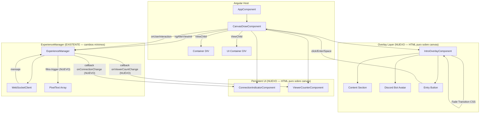
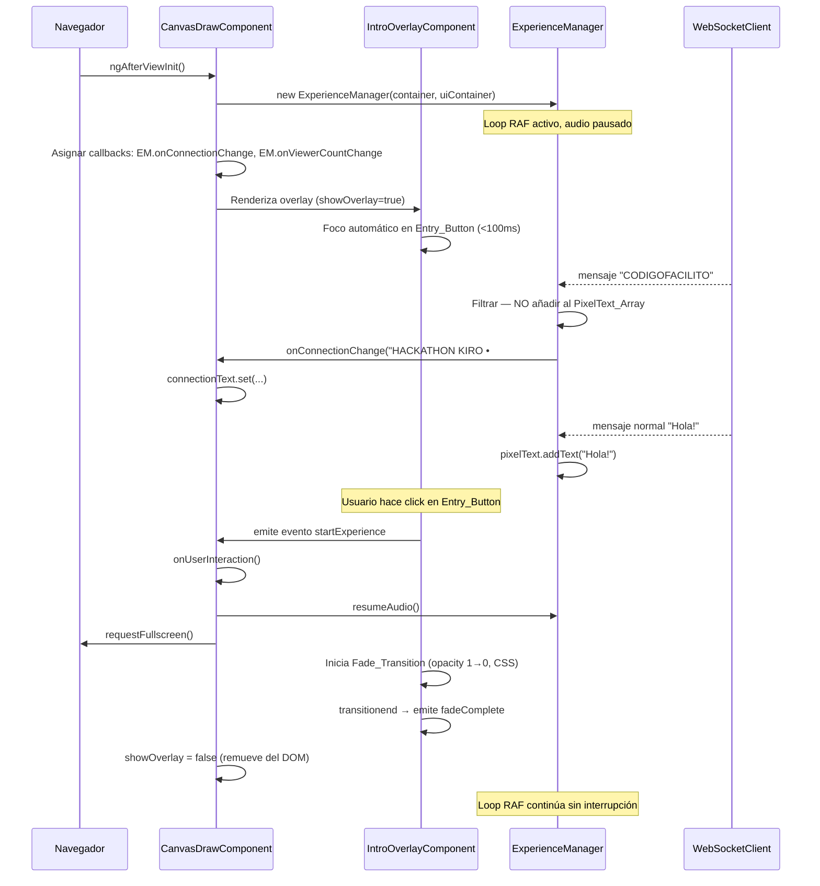
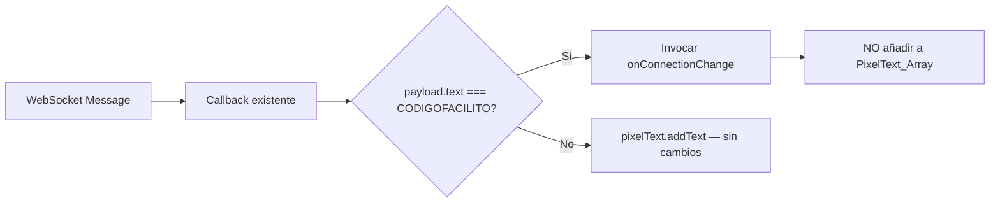

# Documento de Diseño: Intro Entry Menu

## Overview

Este diseño describe la implementación del overlay de entrada (Intro_Overlay) para la experiencia de presentación en vivo rítmica Angular + Three.js conectada a Discord. El overlay reemplaza el `.play-prompt` existente en el componente `CanvasDraw` con una pantalla de entrada completa que presenta información del proyecto, un avatar animado del bot de Discord, un indicador de conexión persistente, un contador de viewers, y un botón de entrada que desbloquea AudioContext y pantalla completa.

### Restricciones de arquitectura

| Restricción | Detalle |
|-------------|---------|
| **No modificar el backend** | Todo el desarrollo se limita al frontend (Angular). El backend es responsabilidad de otro equipo. La lógica de filtrado de "CODIGOFACILITO" y el conteo de viewers se resuelven exclusivamente en frontend al recibir mensajes por WebSocket. |
| **Mínima invasión al sistema 3D** | No se altera la lógica de renderizado, la escena, los shaders, los subsistemas (RenderManager, View, Player, Terrain, Skybox, Stars, LuminousSpheres, etc.) ni la arquitectura del loop de animación. Las únicas modificaciones permitidas al `ExperienceManager` son: **(1)** agregar callbacks de notificación (`onConnectionChange`, `onViewerCountChange`) y **(2)** filtrar mensajes en el callback existente del `WebSocketClient`. Toda nueva funcionalidad UI se implementa como componentes Angular independientes superpuestos al canvas, sin modificar el pipeline de Three.js. |

### Decisiones clave

| Decisión | Justificación |
|----------|---------------|
| Componente Angular standalone (`IntroOverlayComponent`) | Encapsulación completa del overlay; fácil de remover del DOM con `@if`; **no modifica Three.js** |
| Interceptar mensajes WS en el callback existente del ExperienceManager | Mínima superficie de cambio (≤5 líneas de lógica condicional); el callback ya existe, solo se agrega filtrado. **No se crea servicio nuevo ni middleware** |
| Connection_Indicator y Viewer_Counter como componentes Angular independientes | Son persistentes (sobreviven al overlay); se superponen al canvas con z-index propio. **No se integran en la escena 3D** |
| Fade_Transition con CSS `transition` + timeout fallback | Rendimiento nativo GPU vía compositor CSS; el fallback JS garantiza remoción si CSS falla. **Sin tocar el render loop** |
| Focus trap implementado con `cdkTrapFocus` o manual | Accesibilidad WCAG sin dependencias externas pesadas |
| Señal reactiva (`signal`) para estado de conexión y viewers | Angular signals son el mecanismo idóneo para estado UI reactivo sin RxJS adicional |
| Los callbacks en ExperienceManager son opcionales (`if (this.onX)`) | El ExperienceManager funciona exactamente igual si no se asignan callbacks — **zero breaking change** |

## Architecture



### Inventario de cambios vs creaciones

| Elemento | Acción | Descripción |
|----------|--------|-------------|
| `IntroOverlayComponent` | **CREAR** | Componente Angular standalone nuevo, overlay HTML/CSS |
| `ConnectionIndicatorComponent` | **CREAR** | Componente Angular standalone nuevo, UI persistente |
| `ViewerCounterComponent` | **CREAR** | Componente Angular standalone nuevo, UI persistente |
| `CanvasDrawComponent` template | **MODIFICAR** | Reemplazar `.play-prompt` por `<app-intro-overlay>`, agregar los 2 indicadores, alimentar signals |
| `CanvasDrawComponent` class | **MODIFICAR** | Agregar signals reactivos y handlers para los eventos de los nuevos componentes |
| `ExperienceManager.js` constructor | **MODIFICAR (mínimo)** | Agregar filtrado condicional en callback WS existente + 2 propiedades callback opcionales |
| `ExperienceManager.js` loop/render/subsistemas | **NO TOCAR** | Zero cambios al loop de animación, renderizado, escena, shaders o subsistemas |
| `RenderManager`, `View`, `Player`, `Terrain`, `Skybox`, etc. | **NO TOCAR** | Sin modificaciones |
| Backend | **NO TOCAR** | Sin modificaciones |

### Flujo de vida del Overlay



### Flujo de mensajes WebSocket y filtrado



## Components and Interfaces

### Componentes NUEVOS (no modifican Three.js)

#### 1. IntroOverlayComponent (nuevo: `src/app/intro-overlay/intro-overlay.ts`)

Componente Angular standalone que renderiza el overlay de entrada como HTML/CSS puro superpuesto al canvas.

```typescript
@Component({
  selector: 'app-intro-overlay',
  standalone: true,
  templateUrl: './intro-overlay.html',
  styleUrl: './intro-overlay.css'
})
export class IntroOverlayComponent implements AfterViewInit, OnDestroy {
  @ViewChild('entryButton') entryButton!: ElementRef<HTMLButtonElement>;
  @Output() startExperience = new EventEmitter<void>();
  @Output() fadeComplete = new EventEmitter<void>();

  isFading = false;
  private fallbackTimer: any = null;

  ngAfterViewInit(): void {
    // Foco automático en el botón dentro de 100ms
    setTimeout(() => this.entryButton?.nativeElement.focus(), 0);
  }

  onEntryClick(): void {
    if (this.isFading) return;
    this.isFading = true;
    this.startExperience.emit();
    // Fallback: si transitionend no se dispara en 1500ms, forzar remoción
    this.fallbackTimer = setTimeout(() => this.onFadeEnd(), 1500);
  }

  onFadeEnd(): void {
    if (this.fallbackTimer) {
      clearTimeout(this.fallbackTimer);
      this.fallbackTimer = null;
    }
    this.fadeComplete.emit();
  }

  /** Focus trap: interceptar Tab en último/primer elemento */
  onKeydown(event: KeyboardEvent): void {
    if (event.key === 'Tab') {
      // Lógica de focus trap circular
    }
  }

  ngOnDestroy(): void {
    if (this.fallbackTimer) {
      clearTimeout(this.fallbackTimer);
    }
  }
}
```

**Responsabilidades:**
- Renderizar contenido informativo del proyecto (título, descripción, tecnologías, instrucciones)
- Mostrar avatar del bot con animación CSS (sin Three.js)
- Manejar la interacción del Entry_Button (click, Enter, Space)
- Ejecutar la Fade_Transition con CSS transitions (sin modificar el render loop)
- Implementar focus trap para accesibilidad
- Emitir eventos al componente padre para orquestar la acción

**Impacto en Three.js: NINGUNO** — es HTML/CSS puro sobre el canvas.

#### 2. ConnectionIndicatorComponent (nuevo: `src/app/connection-indicator/connection-indicator.ts`)

Componente Angular standalone persistente que muestra el estado de conexión.

```typescript
@Component({
  selector: 'app-connection-indicator',
  standalone: true,
  template: `
    <div class="connection-indicator" aria-live="polite">
      <span class="status-dot"></span>
      <span class="connection-text">{{ connectionText() }}</span>
    </div>
  `,
  styleUrl: './connection-indicator.css'
})
export class ConnectionIndicatorComponent {
  connectionText = input.required<string>();
}
```

**Responsabilidades:**
- Mostrar servidor y canal de Discord actual
- Permanecer visible durante toda la vida de la aplicación (z-index sobre canvas)
- Posicionamiento fijo CSS en esquina del viewport

**Impacto en Three.js: NINGUNO** — es HTML/CSS puro con posición fija.

#### 3. ViewerCounterComponent (nuevo: `src/app/viewer-counter/viewer-counter.ts`)

Componente Angular standalone persistente que muestra el conteo de viewers.

```typescript
@Component({
  selector: 'app-viewer-counter',
  standalone: true,
  template: `
    <div class="viewer-counter" aria-live="polite" aria-atomic="true">
      <span class="viewer-icon">👁</span>
      <span class="viewer-count">{{ count() }}</span>
    </div>
  `,
  styleUrl: './viewer-counter.css'
})
export class ViewerCounterComponent {
  count = input.required<number>();
}
```

**Responsabilidades:**
- Mostrar número de participantes conectados
- Actualizar inmediatamente sin animaciones
- Diseño minimalista dentro de 120px × 40px

**Impacto en Three.js: NINGUNO** — es HTML/CSS puro con posición fija.

---

### Componentes MODIFICADOS

#### 4. CanvasDrawComponent (modificado: `src/app/canvas-draw/canvas-draw.ts`)

**Cambios respecto al estado actual:**
- Reemplaza `.play-prompt` por `<app-intro-overlay>` en el template
- Agrega `<app-connection-indicator>` y `<app-viewer-counter>` como elementos persistentes
- Expone signals de estado reactivo alimentados desde callbacks del ExperienceManager

```typescript
@Component({
  selector: 'app-canvas-draw',
  standalone: true,
  imports: [IntroOverlayComponent, ConnectionIndicatorComponent, ViewerCounterComponent],
  templateUrl: './canvas-draw.html'
})
export class CanvasDraw implements AfterViewInit, OnDestroy {
  showOverlay = true;
  connectionText = signal('Testing Server • #general');
  viewerCount = signal(0);
  audioUnavailable = signal(false);

  ngAfterViewInit() {
    this.ngZone.runOutsideAngular(() => {
      this.experience = new ExperienceManager(
        this.containerRef.nativeElement,
        this.uiContainerRef.nativeElement
      );

      // Asignar callbacks de notificación — única forma de comunicación
      this.experience.onConnectionChange = (text: string) => {
        this.ngZone.run(() => this.connectionText.set(text));
      };
      this.experience.onViewerCountChange = (count: number) => {
        this.ngZone.run(() => this.viewerCount.set(count));
      };

      this.experience.start();
    });
  }

  onStartExperience(): void {
    const el = this.containerRef.nativeElement.parentElement;
    el?.requestFullscreen?.().catch(() => {});
    this.experience?.resumeAudio();
    // Si audio queda suspended tras interacción, informar al usuario
    if (this.experience?.music?.audioContext?.state === 'suspended') {
      this.audioUnavailable.set(true);
    }
  }

  onFadeComplete(): void {
    this.showOverlay = false;
  }

  onUserInteraction(): void {
    this.onStartExperience();
  }
}
```

**Impacto en Three.js: NINGUNO** — solo cambia el template HTML y la lógica Angular del componente host. No se toca `ExperienceManager.start()`, el loop RAF, ni los subsistemas 3D.

---

#### 5. ExperienceManager (modificado: `src/ExperienceManager.js`)

**Principio: cambios quirúrgicos, mínima invasión.**

Solo se modifican **2 aspectos** del archivo existente:
1. Se agregan 2 propiedades callback opcionales (null por defecto)
2. Se modifica el cuerpo del callback del `WebSocketClient` (≤10 líneas) para filtrar el trigger

**Lo que NO se toca:**
- Constructor (creación de subsistemas) — sin cambios
- `start()` — sin cambios
- `animate()` (loop RAF completo) — sin cambios
- `resumeAudio()` — sin cambios
- `dispose()` — sin cambios
- `_setupWebcamDebugControls()` — sin cambios
- Ningún subsistema (RenderManager, View, Player, Terrain, Skybox, Stars, LuminousSpheres, PixelText, etc.)

```javascript
// === NUEVAS PROPIEDADES (agregar después de this.running = false en constructor) ===

// Callbacks opcionales para notificar al frontend Angular
// Si no se asignan, el ExperienceManager funciona exactamente igual que antes
this.onConnectionChange = null;   // (text: string) => void
this.onViewerCountChange = null;  // (count: number) => void

// === MODIFICACIÓN al callback del WebSocketClient (reemplaza el existente) ===

this.wsClient = new WebSocketClient(
    Config.websocket.endpoint,
    (payload) => {
        try {
            const text = payload?.text;
            if (!text) return;

            // NUEVO: Filtrar mensaje trigger — NO añadir al PixelText
            if (text === 'CODIGOFACILITO') {
                if (this.onConnectionChange) {
                    this.onConnectionChange('HACKATHON KIRO • #live');
                }
                return; // Excluir del PixelText_Array
            }

            // NUEVO: Notificar conteo de viewers si el payload lo incluye
            if (payload.viewerCount !== undefined && this.onViewerCountChange) {
                this.onViewerCountChange(payload.viewerCount);
            }

            // EXISTENTE: Sin cambios en esta línea
            this.pixelText.addText(text);
        } catch (error) {
            console.error('[ExperienceManager] Error procesando mensaje WebSocket:', error);
        }
    },
    Config.websocket.reconnect
);
```

**Resumen del delta en ExperienceManager:**
- +2 líneas: declaración de propiedades callback (null)
- +8 líneas: lógica condicional dentro del callback WS existente
- 0 cambios al loop de animación, render, escena, shaders, o subsistemas

## Data Models

### Estado del Overlay

```typescript
interface OverlayState {
  visible: boolean;       // Si el overlay está en el DOM
  isFading: boolean;      // Si la Fade_Transition está en progreso
}
```

### Estado de Conexión (signal en CanvasDrawComponent)

```typescript
connectionText: WritableSignal<string> = signal('Testing Server • #general');
```

Valores posibles:
- `'Testing Server • #general'` — estado por defecto al cargar
- `'HACKATHON KIRO • #live'` — tras recibir mensaje trigger "CODIGOFACILITO"

### Estado de Viewers (signal en CanvasDrawComponent)

```typescript
viewerCount: WritableSignal<number> = signal(0);
```

### Contenido estático del overlay

```typescript
interface OverlayContent {
  title: string;              // Título del proyecto (max 50 chars)
  description: string;        // Descripción del proyecto (max 400 chars)
  technologies: string[];     // Lista de tecnologías
  instructions: string;       // Instrucciones de interacción (max 250 chars)
  buttonText: string;         // Texto del Entry_Button (min 2 palabras, verbo de acción)
  avatarSrc: string;          // URL de la imagen del avatar del bot
}
```

### Configuración de la Fade_Transition

```css
/* Constantes CSS */
--fade-duration: 800ms;           /* Entre 600ms y 1200ms */
--fade-timing: ease-out;
--fallback-timeout: 1500ms;       /* Timeout JS de fallback */
--dom-removal-delay: 50ms;        /* < 100ms post transitionend */
```

## Correctness Properties

*Una propiedad es una característica o comportamiento que debe mantenerse verdadero en todas las ejecuciones válidas de un sistema — esencialmente, una declaración formal sobre lo que el sistema debe hacer. Las propiedades sirven como puente entre especificaciones legibles por humanos y garantías de corrección verificables por máquina.*

### Property 1: Entry_Button ignora interacciones durante Fade_Transition

*Para cualquier* evento de interacción (click, keydown Enter, keydown Space) emitido mientras `isFading === true`, el Entry_Button no debe ejecutar la acción de inicio de experiencia y debe tener el atributo `disabled` presente.

**Validates: Requirements 4.3**

### Property 2: Activación por teclado equivalente a click

*Para cualquier* método de activación del Entry_Button (click del mouse, tecla Enter con foco, tecla Space con foco), el resultado observable debe ser idéntico: se emite `startExperience`, se inicia la Fade_Transition, se invoca `resumeAudio()`, y se solicita `requestFullscreen`.

**Validates: Requirements 6.1**

### Property 3: Focus trap dentro del overlay

*Para cualquier* número N de pulsaciones consecutivas de Tab (o Shift+Tab) mientras el Intro_Overlay está visible, el elemento con foco (`document.activeElement`) siempre debe ser un descendiente del contenedor del overlay.

**Validates: Requirements 6.4**

### Property 4: Mensajes trigger se excluyen del PixelText_Array

*Para cualquier* secuencia de mensajes WebSocket recibidos donde algunos contienen `text === "CODIGOFACILITO"`, el PixelText_Array nunca debe contener la cadena "CODIGOFACILITO", y todos los mensajes con texto diferente sí deben aparecer en el array.

**Validates: Requirements 8.5**

### Property 5: Viewer counter refleja último valor inmediatamente

*Para cualquier* secuencia ordenada de actualizaciones de `viewerCount` con valores arbitrarios (≥ 0), el valor mostrado en el Viewer_Counter siempre debe ser igual al último valor recibido, sin delay de animación.

**Validates: Requirements 9.4**

## Error Handling

### Errores de interacción de usuario

| Escenario | Estrategia |
|-----------|------------|
| `requestFullscreen` rechazado por el navegador | Catch silencioso; la experiencia continúa en modo ventana sin interrupción (Req. 3.5) |
| `AudioContext.resume()` falla o queda en `suspended` | Continuar experiencia visual; mostrar indicador `audioUnavailable` en el UI (Req. 3.6) |
| `transitionend` nunca se dispara (CSS bug, tab en background) | Fallback JS con `setTimeout(1500ms)` fuerza remoción del DOM (Req. 4.4) |

### Errores de WebSocket

| Escenario | Estrategia |
|-----------|------------|
| WebSocket no conecta | Connection_Indicator muestra estado por defecto; reconexión automática con backoff (ya implementado en WebSocketClient — sin cambios) |
| Mensaje con JSON inválido | WebSocketClient lo descarta con warning (ya implementado — sin cambios) |
| Payload sin campo `text` | Early return en el callback; no crashea |

### Errores de renderizado

| Escenario | Estrategia |
|-----------|------------|
| Overlay no se remueve del DOM tras fade | El fallback timeout fuerza `showOverlay = false`; ExperienceManager continúa sin degradación (Req. 7.5) |
| Foco no se establece en Entry_Button (headless, mobile) | No bloquea funcionalidad; el botón sigue siendo clickeable |
| Avatar del bot no carga (404) | Mostrar placeholder con el efecto de animación CSS igualmente |

### Garantía de mínima invasión ante errores

Ningún error en los componentes nuevos (overlay, indicadores) puede afectar al loop de animación de Three.js. Los callbacks son opcionales y están envueltos en condicional `if (this.onX)`, por lo que si Angular falla, el ExperienceManager sigue ejecutando sin degradación.

## Testing Strategy

### Unit Tests (Vitest + jsdom)

Tests de ejemplo y edge cases para verificar:

- **IntroOverlayComponent renderizado**: Presencia de título, descripción, tecnologías, instrucciones, botón
- **Contenido informativo**: Título con font-size >= 24px, descripción <= 400 chars, instrucciones <= 250 chars
- **Entry_Button texto**: Contiene >= 2 palabras y verbo de acción
- **Fade_Transition timing**: CSS transition-duration entre 600-1200ms configurado
- **Remoción del DOM**: Tras transitionend, overlay se remueve dentro de 100ms
- **Fallback timeout**: Si transitionend no se dispara, overlay se remueve a los 1500ms
- **requestFullscreen invocado**: Al hacer click en Entry_Button
- **resumeAudio invocado**: Al hacer click en Entry_Button
- **Fullscreen rechazado**: Experiencia continúa sin error
- **AudioContext falla**: Se muestra indicador de audio no disponible
- **Atributos ARIA**: role, aria-label, aria-labelledby presentes
- **Foco automático**: Entry_Button recibe foco dentro de 100ms
- **Connection_Indicator estado inicial**: Muestra servidor de pruebas
- **Connection_Indicator cambio**: Cambia a "HACKATHON KIRO" al recibir trigger
- **Avatar animación**: animation-duration entre 2-6s, tamaño entre 64-200px, aspect-ratio 1:1
- **Hover en Entry_Button**: Cambio visual en <= 150ms (transition CSS)
- **Focus visible**: Indicador de foco con contraste >= 3:1
- **Mínima invasión**: Verificar que ExperienceManager.animate() no fue modificado (snapshot del método)

### Property-Based Tests (fast-check + Vitest)

Biblioteca: **fast-check** (compatible con Vitest).

Configuración: mínimo 100 iteraciones por propiedad.

```typescript
// Formato de tags:
// Feature: intro-entry-menu, Property {N}: {texto}
```

**Propiedades a implementar:**

1. **Button disabled durante fade** — Generar eventos aleatorios (click, Enter, Space) mientras `isFading=true`, verificar que ninguno dispara `startExperience`.
   - Tag: `Feature: intro-entry-menu, Property 1: Entry_Button ignora interacciones durante Fade_Transition`

2. **Activación equivalente** — Para cada método de activación (click, Enter, Space), verificar que las mismas funciones son invocadas en el mismo orden.
   - Tag: `Feature: intro-entry-menu, Property 2: Activación por teclado equivalente a click`

3. **Focus trap** — Generar secuencias de N pulsaciones de Tab/Shift+Tab, verificar que activeElement siempre está dentro del overlay.
   - Tag: `Feature: intro-entry-menu, Property 3: Focus trap dentro del overlay`

4. **Filtrado de mensajes trigger** — Generar secuencias aleatorias de mensajes (algunos "CODIGOFACILITO", otros texto aleatorio), verificar que PixelText_Array contiene solo los no-trigger.
   - Tag: `Feature: intro-entry-menu, Property 4: Mensajes trigger se excluyen del PixelText_Array`

5. **Viewer counter actualización** — Generar secuencias de N valores numéricos (≥ 0), aplicarlos secuencialmente al signal, verificar que el valor mostrado siempre es el último.
   - Tag: `Feature: intro-entry-menu, Property 5: Viewer counter refleja último valor inmediatamente`

### Integration Tests

- **Reemplazo de play-prompt**: Verificar que `.play-prompt` no existe y que `app-intro-overlay` está presente con z-index >= 10
- **Loop de animación activo con overlay**: ExperienceManager.rafId no es null mientras overlay está visible
- **Transición sin re-instanciación**: Al descartar overlay, no se invoca constructor de ningún subsistema
- **Overlay no bloquea tras remoción fallida**: Si overlay permanece en DOM, pointer-events se deshabilitan como fallback
- **WebSocket integración completa**: Mensaje llega → se filtra o se añade a PixelText correctamente
- **Mínima invasión verificable**: Confirmar que los únicos cambios en ExperienceManager son las 2 propiedades callback y el condicional en el callback WS (no hay cambios en `animate()`, `start()`, `dispose()`, ni subsistemas)
