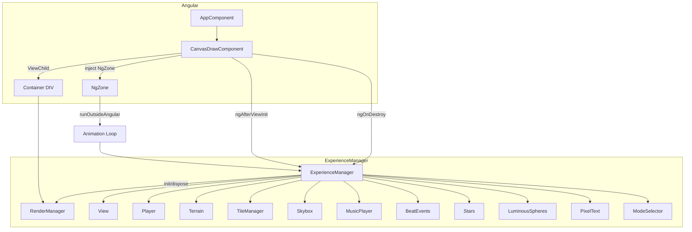

# Documento de Diseño: Integración Three.js en Angular

## Overview

Este diseño describe cómo integrar la experiencia interactiva 3D existente dentro del ciclo de vida del componente Angular `canvas-draw`. Los módulos JavaScript del proyecto original se mueven directamente a `src/` del proyecto Angular (junto al código TypeScript). La estrategia central es crear una capa de orquestación (`ExperienceManager`) que encapsule la inicialización, el loop de animación y la destrucción completa de todos los subsistemas Three.js, sin convertir los archivos JavaScript originales a TypeScript.

### Decisiones clave

| Decisión | Justificación |
|----------|---------------|
| Mantener archivos `.js` sin conversión a TypeScript | Minimizar cambios en el código Three.js probado; usar `allowJs: true` en tsconfig |
| Mover módulos JS a `src/` junto al código Angular | Un solo `src/`, sin necesidad de configurar includes externos; simplifica el build |
| Crear `ExperienceManager` como fachada | Centralizar init/dispose en un solo punto de contacto para Angular |
| Modificar `RenderManager` para aceptar container | Mínimo cambio (1 parámetro); evita montar en `document.body` |
| Modificar `Player` para desregistrar listeners | Esencial para evitar memory leaks en SPA |
| `ModeSelector` monta DOM en container Angular | Evita elementos huérfanos en `document.body` al navegar |
| `NgZone.runOutsideAngular` para el RAF loop | El loop a 60fps dispararía ~60 change detections/seg sin esto |
| Assets copiados a `public/` del proyecto Angular | Las rutas relativas (`/audio/...`, `/fonts/...`) resuelven igual que en Vite |
| Archivos de `modern/src/` se copian (no se eliminan) | La carpeta `modern/` se mantiene como referencia local sin trackear en git; los archivos se copian a `src/` y se modifican ahí |

## Architecture



### Flujo de vida

```mermaid
sequenceDiagram
    participant Angular as CanvasDrawComponent
    participant EM as ExperienceManager
    participant RM as RenderManager
    participant Loop as Animation Loop

    Angular->>Angular: ngAfterViewInit()
    Angular->>EM: new ExperienceManager(container, uiContainer)
    EM->>RM: new RenderManager(container)
    RM->>RM: appendChild(canvas) al container
    EM->>EM: Crear View, Player, Terrain, etc.
    Angular->>Angular: NgZone.runOutsideAngular()
    Angular->>EM: start()
    EM->>Loop: requestAnimationFrame(animate)
    Loop-->>Loop: update todos los subsistemas
    Loop-->>Loop: view.render()

    Note over Angular: Usuario navega fuera
    Angular->>Angular: ngOnDestroy()
    Angular->>EM: dispose()
    EM->>Loop: cancelAnimationFrame()
    EM->>RM: renderer.dispose()
    EM->>EM: removeEventListeners (Player, resize)
    EM->>EM: MusicPlayer.dispose()
    EM->>EM: Dispose geometrías, materiales, texturas
```

## Components and Interfaces

### 1. ExperienceManager (nuevo archivo: `src/ExperienceManager.js`)

Fachada que orquesta la creación, actualización y destrucción de toda la experiencia.

```javascript
/**
 * @param {HTMLElement} container - Elemento DOM donde se monta el canvas WebGL
 * @param {HTMLElement} uiContainer - Elemento DOM donde se montan los controles UI
 */
export class ExperienceManager {
  constructor(container, uiContainer) { ... }
  
  /** Inicia el audio y el loop de animación */
  start() { ... }
  
  /** Loop de animación (llamado internamente via RAF) */
  animate() { ... }
  
  /** Detiene el loop, libera todos los recursos */
  dispose() { ... }
}
```

**Responsabilidades:**
- Instancia todos los subsistemas en el orden correcto
- Gestiona el `requestAnimationFrame` ID para poder cancelarlo
- En `dispose()`: cancela RAF, pausa audio, cierra AudioContext, remueve listeners, dispone renderer y geometrías/materiales/texturas

### 2. RenderManager (modificado)

**Cambios respecto al original:**
- Constructor acepta `container` como parámetro obligatorio
- Usa `container.clientWidth` / `container.clientHeight` en lugar de `window.innerWidth` / `window.innerHeight`
- El resize listener observa el container (via `ResizeObserver`) en lugar de `window.resize`
- Expone método `dispose()` que desconecta el `ResizeObserver` y llama `renderer.dispose()`

```javascript
export class RenderManager {
  constructor(container) {
    this.container = container;
    this.renderer = new THREE.WebGLRenderer({ ... });
    this.renderer.setSize(container.clientWidth, container.clientHeight);
    container.appendChild(this.renderer.domElement);
    
    this.resizeObserver = new ResizeObserver(() => this.onResize());
    this.resizeObserver.observe(container);
  }
  
  onResize() {
    const w = this.container.clientWidth;
    const h = this.container.clientHeight;
    this.renderer.setSize(w, h);
  }
  
  dispose() {
    this.resizeObserver.disconnect();
    this.renderer.dispose();
  }
}
```

### 3. View (modificado)

**Cambios:**
- `onResize()` usa las dimensiones del container (recibidas del RenderManager) en lugar de `window.innerWidth/Height`
- Se elimina el `window.addEventListener('resize', ...)` propio; el RenderManager notifica via callback o el View lee del renderer

```javascript
export class View {
  constructor(renderManager) {
    this.renderer = renderManager.renderer;
    this.container = renderManager.container;
    // ... cámara, escena, postprocessing igual
  }
  
  onResize() {
    const w = this.container.clientWidth;
    const h = this.container.clientHeight;
    this.camera.aspect = w / h;
    this.camera.updateProjectionMatrix();
    this.composer.setSize(w, h);
  }
}
```

### 4. Player (modificado)

**Cambios:**
- `setupInput()` almacena referencias a los handlers para poder removerlos
- Nuevo método `dispose()` que llama `window.removeEventListener` para cada handler registrado

```javascript
export class Player {
  setupInput() {
    this._onMouseMove = (e) => { ... };
    this._onMouseDown = () => { this.mouseDown = true; };
    this._onMouseUp = () => { this.mouseDown = false; };
    this._onTouchMove = (e) => { ... };
    this._onTouchStart = () => { this.mouseDown = true; };
    this._onTouchEnd = () => { this.mouseDown = false; };

    window.addEventListener('mousemove', this._onMouseMove);
    window.addEventListener('mousedown', this._onMouseDown);
    window.addEventListener('mouseup', this._onMouseUp);
    window.addEventListener('touchmove', this._onTouchMove);
    window.addEventListener('touchstart', this._onTouchStart);
    window.addEventListener('touchend', this._onTouchEnd);
  }
  
  dispose() {
    window.removeEventListener('mousemove', this._onMouseMove);
    window.removeEventListener('mousedown', this._onMouseDown);
    window.removeEventListener('mouseup', this._onMouseUp);
    window.removeEventListener('touchmove', this._onTouchMove);
    window.removeEventListener('touchstart', this._onTouchStart);
    window.removeEventListener('touchend', this._onTouchEnd);
  }
}
```

### 5. MusicPlayer (modificado)

**Cambios:**
- Nuevo método `dispose()` que pausa el audio, cierra el AudioContext y desconecta nodos

```javascript
export class MusicPlayer {
  dispose() {
    this.audio.pause();
    this.audio.src = '';
    this.playing = false;
    if (this.audioContext.state !== 'closed') {
      this.audioContext.close();
    }
  }
}
```

### 6. ModeSelector (modificado)

**Cambios:**
- Constructor acepta un `uiContainer` en lugar de montar en `document.body`
- `dispose()` remueve los elementos DOM del container

```javascript
export class ModeSelector {
  constructor(beatEvents, terrain, spheres, uiContainer) {
    // ... crear botones igual que antes ...
    uiContainer.appendChild(this.container);
    uiContainer.appendChild(this.patternContainer);
    uiContainer.appendChild(this.textureContainer);
    // bandPanel también en uiContainer
  }
  
  dispose() {
    this.container.remove();
    this.patternContainer.remove();
    this.textureContainer.remove();
    // Remover bandPanel
  }
}
```

### 7. CanvasDrawComponent (transformado)

```typescript
@Component({
  selector: 'app-canvas-draw',
  standalone: true,
  template: `
    <div #threeContainer class="three-container"></div>
    <div #uiContainer class="ui-container"></div>
    <div *ngIf="showPlayPrompt" class="play-prompt" (click)="onUserInteraction()">
      Click para iniciar experiencia
    </div>
  `,
  styles: [`
    :host { display: block; width: 100vw; height: 100vh; overflow: hidden; position: relative; }
    .three-container { width: 100%; height: 100%; }
    .ui-container { position: absolute; top: 0; left: 0; width: 100%; height: 100%; pointer-events: none; }
    .ui-container > * { pointer-events: auto; }
    .play-prompt { /* overlay centrado */ }
  `]
})
export class CanvasDraw implements AfterViewInit, OnDestroy {
  @ViewChild('threeContainer') containerRef!: ElementRef<HTMLDivElement>;
  @ViewChild('uiContainer') uiContainerRef!: ElementRef<HTMLDivElement>;
  
  private experience: any;
  private ngZone = inject(NgZone);
  showPlayPrompt = false;

  ngAfterViewInit() {
    this.ngZone.runOutsideAngular(() => {
      this.experience = new ExperienceManager(
        this.containerRef.nativeElement,
        this.uiContainerRef.nativeElement
      );
      this.experience.start();
    });
  }

  onUserInteraction() {
    this.experience?.resumeAudio();
    this.showPlayPrompt = false;
  }

  ngOnDestroy() {
    this.experience?.dispose();
    this.experience = null;
  }
}
```

## Data Models

### State (sin cambios respecto al original)

```javascript
const state = {
  time: 0,          // Tiempo acumulado en segundos
  deltaTime: 0,     // Delta entre frames (clampeado a 0.2 max)
  colors: Config.colors,
  skyboxPulse: 0    // Intensidad del pulso del skybox (0-1)
};
```

### Orden de actualización en el loop

El loop debe preservar exactamente el orden del `main.js` original:

```
1. player.update(state)
2. terrain.update()
3. tileManager.update()
4. beatEvents.update(state, music)
5. stars.update(state)
6. spheres.update(state)
7. pixelText.update(state)
8. Verificar beatTriggered → stars.onBeat(), spheres.onBeat()
9. state.skyboxPulse = beatEvents.getSkyboxPulse()
10. skybox.update(state)
11. view.render()
```

### Configuración de compilación

**tsconfig.app.json** (cambios necesarios):

```jsonc
{
  "extends": "./tsconfig.json",
  "compilerOptions": {
    "allowJs": true,
    "checkJs": false,
    "types": []
  },
  "include": [
    "src/**/*.ts",
    "src/**/*.js"
  ]
}
```

### Estructura de archivos final

```
hack_kiro/
├── public/
│   ├── audio/
│   │   └── music.mp3
│   └── fonts/
│       ├── pixel-font-atlas.fnt
│       └── pixel-font-atlas.png
├── src/
│   ├── app/
│   │   └── canvas-draw/
│   │       ├── canvas-draw.ts     ← TRANSFORMADO
│   │       └── canvas-draw.html   ← TRANSFORMADO
│   ├── experience/
│   │   ├── RenderManager.js       ← MODIFICADO (acepta container)
│   │   ├── View.js                ← MODIFICADO (usa container dims)
│   │   ├── Player.js              ← MODIFICADO (dispose listeners)
│   │   └── Skybox.js
│   ├── terrain/
│   │   ├── Terrain.js
│   │   ├── TerrainPlane.js
│   │   └── TileManager.js
│   ├── events/
│   │   ├── MusicPlayer.js         ← MODIFICADO (dispose audio)
│   │   ├── BeatEvents.js
│   │   └── PhaseManager.js
│   ├── particles/
│   │   ├── Stars.js
│   │   └── LuminousSpheres.js
│   ├── ui/
│   │   ├── ModeSelector.js        ← MODIFICADO (acepta uiContainer)
│   │   └── PixelText.js
│   ├── Config.js
│   ├── ExperienceManager.js       ← NUEVO
│   ├── main.ts                    ← Angular bootstrap (sin cambios)
│   ├── index.html
│   └── styles.css
├── package.json                   ← +three ^0.170.0
├── tsconfig.app.json              ← +allowJs, +include src/**/*.js
└── angular.json                   ← assets config sin cambio (public/ ya incluido)
```

## Correctness Properties

*Una propiedad es una característica o comportamiento que debe mantenerse verdadero en todas las ejecuciones válidas de un sistema — esencialmente, una declaración formal sobre lo que el sistema debe hacer. Las propiedades sirven como puente entre especificaciones legibles por humanos y garantías de corrección verificables por máquina.*

### Property 1: Canvas se monta en el container proporcionado

*Para cualquier* elemento HTML válido proporcionado como container al RenderManager, el `domElement` del renderer WebGL debe ser hijo directo de ese container (nunca de `document.body`).

**Validates: Requirements 4.1**

### Property 2: Canvas refleja dimensiones del container

*Para cualquier* container con dimensiones arbitrarias (width, height > 0), en cualquier momento tras la inicialización o tras un cambio de tamaño del container, el canvas del renderer debe tener las mismas dimensiones que el container.

**Validates: Requirements 4.2, 4.3**

### Property 3: Dispose cancela el Animation Loop

*Para cualquier* estado de la experiencia en ejecución (con un `requestAnimationFrame` pendiente), invocar `dispose()` debe resultar en que no se programe ningún nuevo frame de animación.

**Validates: Requirements 5.2**

### Property 4: Dispose remueve todos los event listeners de window

*Para cualquier* conjunto de event listeners registrados por Player en `window` durante la inicialización, invocar `dispose()` debe resultar en que `window` ya no tenga ninguno de esos handlers registrados.

**Validates: Requirements 5.5**

### Property 5: DeltaTime nunca excede 0.2 segundos

*Para cualquier* diferencia de tiempo entre frames consecutivos (incluyendo valores arbitrariamente grandes provocados por pérdida de foco del tab), el `deltaTime` calculado en el Animation Loop nunca debe exceder 0.2 segundos.

**Validates: Requirements 8.3**

## Error Handling

### Errores de inicialización

| Escenario | Estrategia |
|-----------|------------|
| WebGL no soportado | `THREE.WebGLRenderer` lanza excepción → capturar en ExperienceManager, mostrar mensaje de fallback en el container |
| Container sin dimensiones (0×0) | Detectar en RenderManager constructor, loguear warning. El ResizeObserver actualizará cuando el layout se resuelva |
| Fetch de font falla | PixelText ya maneja esto gracefully (no crashea, simplemente `ready` nunca se vuelve `true`) |
| AudioContext bloqueado por autoplay policy | Mostrar overlay de "click para iniciar", MusicPlayer intenta reproducir tras interacción |

### Errores en runtime

| Escenario | Estrategia |
|-----------|------------|
| Excepción dentro del loop de animación | Envolver el contenido del `animate()` en try/catch, loguear error, continuar el loop para no congelar la pantalla |
| ResizeObserver loop limit exceeded | Es un warning del browser, no un error fatal; se ignora |
| Audio decode error | MusicPlayer continúa sin audio; la experiencia visual funciona independientemente |

### Cleanup incompleto

Si `dispose()` falla parcialmente (e.g., AudioContext ya cerrado), cada paso de cleanup se envuelve en try/catch individual para garantizar que los demás pasos se ejecuten.

## Testing Strategy

### Unit Tests (Vitest)

Tests de ejemplo y edge cases:

- **ExperienceManager init**: verificar que todos los subsistemas se instancian correctamente
- **ExperienceManager dispose**: verificar que renderer.dispose(), audio.pause(), audioContext.close() son invocados
- **Orden de update**: spy en los métodos update(), verificar secuencia correcta
- **NgZone isolation**: verificar que RAF se registra dentro de runOutsideAngular
- **Autoplay handling**: simular AudioContext suspended → verificar overlay visible → simular click → verificar audio.play() invocado
- **Container sin dimensiones**: verificar que no lanza excepción

### Property-Based Tests (fast-check)

Biblioteca elegida: **fast-check** (ya compatible con Vitest en el proyecto).

Configuración: mínimo 100 iteraciones por propiedad.

```typescript
// Formato de tags:
// Feature: threejs-angular-integration, Property {N}: {texto}
```

**Propiedades a implementar:**

1. **Container mounting** — Generar elementos DOM con distintos IDs/clases, verificar que el canvas siempre es hijo del container proporcionado.
   - Tag: `Feature: threejs-angular-integration, Property 1: Canvas se monta en el container proporcionado`

2. **Container sizing** — Generar pares (width, height) aleatorios en rango [1, 4096], verificar que el renderer reporta esas dimensiones.
   - Tag: `Feature: threejs-angular-integration, Property 2: Canvas refleja dimensiones del container`

3. **Animation loop cancellation** — Generar secuencias de start/dispose en diferentes momentos, verificar que tras dispose no hay RAF pendiente.
   - Tag: `Feature: threejs-angular-integration, Property 3: Dispose cancela el Animation Loop`

4. **Event listener cleanup** — Registrar listeners, verificar su presencia, invocar dispose, verificar ausencia.
   - Tag: `Feature: threejs-angular-integration, Property 4: Dispose remueve todos los event listeners de window`

5. **DeltaTime clamping** — Generar deltas de tiempo aleatorios en rango [0, 100000] ms, verificar que el deltaTime resultante nunca excede 0.2.
   - Tag: `Feature: threejs-angular-integration, Property 5: DeltaTime nunca excede 0.2 segundos`

### Integration Tests

- **Build smoke test**: `ng build` compila sin errores con los Modern_Modules importados
- **Asset resolution**: verificar que `/audio/music.mp3` y `/fonts/pixel-font-atlas.*` se sirven correctamente en dev server
- **Full lifecycle**: componente se monta, experiencia arranca, navegar fuera → componente se destruye sin warnings en consola
