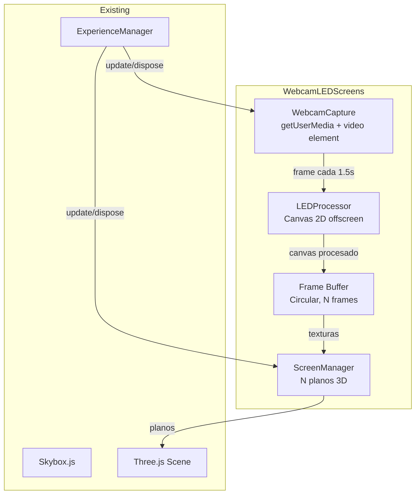

# Diseño Técnico — Webcam LED Skybox

## Overview

Esta feature captura frames de la webcam del usuario a baja frecuencia (~1 frame cada 1.5s), los procesa con un efecto visual tipo pantalla LED/dot-matrix, y los muestra como múltiples pantallas distribuidas alrededor de la escena 3D. Cada pantalla muestra un frame diferente ordenado secuencialmente, creando un efecto de timeline visual envolvente tipo estadio.

### Flujo de datos

```
Webcam (getUserMedia) → Canvas auxiliar (drawImage) → LED_Processor (dot-matrix) → Buffer circular de CanvasTextures → Planos 3D distribuidos en la escena
```

### Principios de diseño

1. **Opcional**: Si el usuario no da permiso de cámara, todo sigue funcionando con el skybox animado original.
2. **Performance first**: Captura a baja frecuencia (1.5s), procesamiento en canvas offscreen, sin bloquear el render loop.
3. **Reutilización**: Canvas y texturas se reutilizan entre frames, sin crear/destruir objetos por ciclo.
4. **Integración limpia**: Se integra como un subsistema más del ExperienceManager, siguiendo el patrón `update(state)` / `dispose()`.

## Architecture



### Decisiones arquitectónicas

| Decisión | Razón |
|----------|-------|
| Pantallas como planos individuales (no modificar el skybox mesh) | El skybox existente sigue funcionando con su color animado. Las pantallas son objetos adicionales en la escena. |
| Buffer circular de canvases | Reutilizar los mismos canvas/texturas evita GC y allocs por frame. Solo se rota la referencia. |
| Captura cada 1.5s | Suficiente para el efecto visual. Más frecuente degrada FPS sin mejorar la estética LED. |
| Planos orientados hacia el centro | Siempre visibles para el jugador sin importar su rotación. |
| Un solo módulo (`WebcamLEDScreens`) orquesta todo | Encapsula webcam + procesador + pantallas en una sola clase con interfaz simple. |
| `fog: false` en el material de las pantallas | La niebla de la escena (fogAmount: 0.002) opaca objetos lejanos. Las pantallas LED deben verse brillantes siempre, como pantallas reales que emiten luz propia. |
| `renderOrder` alto en las pantallas | Asegurar que las pantallas se rendericen después del skybox pero antes de partículas cercanas, evitando problemas de z-fighting con el fondo. |

## Components and Interfaces

### 1. `src/services/WebcamLEDScreens.js` — Módulo principal

Clase que encapsula toda la funcionalidad: captura, procesamiento y renderizado de pantallas.

```javascript
class WebcamLEDScreens {
    constructor(scene, player, config)
    
    // Interfaz pública (patrón de subsistema del ExperienceManager)
    async init()          // Solicitar cámara y crear pantallas
    update(state)         // Gestionar temporización de captura + seguir jugador
    dispose()             // Liberar cámara, canvas, meshes

    // Privados
    _captureFrame()       // Capturar frame del video al canvas auxiliar
    _processLED(sourceCanvas)  // Aplicar efecto dot-matrix
    _rotateBuffer()       // Rotar buffer circular y actualizar texturas
    _createScreens()      // Crear los N planos distribuidos en la escena
}
```

### 2. Captura de webcam

```javascript
// Solicitar cámara con resolución limitada
const stream = await navigator.mediaDevices.getUserMedia({
    video: { width: { ideal: 320 }, height: { ideal: 240 } }
});

// Video element oculto como fuente de frames
this._video = document.createElement('video');
this._video.srcObject = stream;
this._video.play();

// Canvas auxiliar para capturar frames
this._captureCanvas = document.createElement('canvas');
this._captureCanvas.width = 320;
this._captureCanvas.height = 240;
this._captureCtx = this._captureCanvas.getContext('2d');
```

### 3. Procesador LED (dot-matrix)

```javascript
// Configuración del grid
const gridWidth = 64;   // Columnas de puntos
const gridHeight = 36;  // Filas de puntos
const dotRadius = 0.8;  // Radio relativo al tamaño de celda (0-1)

// Canvas de salida (LED)
const ledCanvas = document.createElement('canvas');
ledCanvas.width = 512;   // Resolución de textura (potencia de 2)
ledCanvas.height = 288;

// Procesamiento por frame:
// 1. Dibujar fondo negro
// 2. Para cada celda (i, j) del grid:
//    a. Muestrear color del frame original en la posición correspondiente
//    b. Dibujar un círculo con ese color en la posición (i, j) del LED canvas
```

### 4. Buffer circular y pantallas 3D

```javascript
// Buffer circular de N frames (cada uno es un canvas + textura)
const SCREEN_COUNT = 8;

this._screens = [];  // Array de { canvas, texture, mesh }

// Disposición circular alrededor del jugador
for (let i = 0; i < SCREEN_COUNT; i++) {
    const angle = (i / SCREEN_COUNT) * Math.PI * 2;
    const radius = 600;  // Distancia al jugador
    const width = 300;   // Ancho del plano
    const height = 170;  // Alto del plano (16:9 aprox)

    const geometry = new THREE.PlaneGeometry(width, height);
    const material = new THREE.MeshBasicMaterial({
        map: texture,
        side: THREE.DoubleSide,
        fog: false,          // Ignorar la niebla — las pantallas deben verse siempre brillantes
        transparent: true,
        opacity: 0.9
    });

    const mesh = new THREE.Mesh(geometry, material);
    mesh.position.set(
        Math.cos(angle) * radius,
        50,  // Altura fija, ligeramente arriba del terreno
        Math.sin(angle) * radius
    );
    mesh.lookAt(0, 50, 0);  // Orientar hacia el centro
    
    scene.add(mesh);
}
```

### 5. Rotación del buffer

Cuando llega un nuevo frame:
1. El canvas más antiguo se reutiliza para el frame nuevo (se pinta encima)
2. Se rota el índice del buffer: el frame nuevo va a la pantalla "más reciente"
3. Las texturas se redistribuyen: pantalla 0 = frame más nuevo, pantalla N-1 = más antiguo
4. Solo se marca `needsUpdate = true` en la textura del frame nuevo

### 6. Integración con ExperienceManager

```javascript
// En ExperienceManager.constructor():
this.webcamScreens = new WebcamLEDScreens(
    this.view.scene,
    this.player,
    Config.webcam
);
this.webcamScreens.init();  // Async — no bloquea la construcción

// En ExperienceManager.animate():
this.webcamScreens.update(this.state);

// En ExperienceManager.dispose():
this.webcamScreens.dispose();
```

## Data Models

### Configuración (`Config.js` — sección webcam)

```javascript
webcam: {
    enabled: true,
    frameInterval: 1500,     // ms entre capturas
    gridWidth: 64,           // Columnas del dot-grid
    gridHeight: 36,          // Filas del dot-grid
    dotRadiusRatio: 0.8,     // Radio del punto relativo a celda (0-1)
    screenCount: 8,          // Número de pantallas alrededor
    screenRadius: 600,       // Distancia de las pantallas al centro
    screenWidth: 300,        // Ancho de cada pantalla (unidades 3D)
    screenHeight: 170,       // Alto de cada pantalla
    screenAltitude: 50       // Altura Y de las pantallas
}
```

### Estado interno del módulo

```javascript
{
    active: boolean,          // Si la webcam está activa
    video: HTMLVideoElement,  // Elemento video oculto
    stream: MediaStream,      // Stream de la webcam
    captureCanvas: HTMLCanvasElement,  // Canvas para drawImage del video
    screens: [                // Array circular de pantallas
        {
            canvas: HTMLCanvasElement,   // Canvas LED de esta pantalla
            ctx: CanvasRenderingContext2D,
            texture: THREE.CanvasTexture,
            mesh: THREE.Mesh
        }
    ],
    bufferIndex: number,      // Índice actual en el buffer circular
    lastCaptureTime: number   // Timestamp de la última captura
}
```

## Error Handling

| Escenario | Acción |
|-----------|--------|
| Navegador no soporta getUserMedia | Log info, no crear pantallas, skybox original sigue |
| Usuario deniega permiso de cámara | Log info, no crear pantallas, skybox original sigue |
| Stream de video se interrumpe | Detener captura, remover pantallas, restaurar skybox |
| Error en procesamiento de un frame | Log warning, saltear ese frame, continuar con el siguiente |
| Tab pierde visibilidad | Pausar captura (no consume recursos) |
| Tab recupera visibilidad | Reanudar captura automáticamente |

## Performance Considerations

- **Captura**: `drawImage` de un video 320x240 → ~0.1ms
- **Procesamiento LED**: Iterar 64×36 = 2304 celdas dibujando círculos → ~2-3ms
- **Textura upload**: Un `needsUpdate` por ciclo de 1.5s → negligible
- **Memoria**: 8 canvas de 512x288 = ~4.5MB VRAM total — aceptable
- **FPS impact**: Procesamiento cada 1500ms, no en cada frame de animación → impacto ~0

## Beat Reaction

Las pantallas pulsan con el beat de la música. En `update(state)`:

```javascript
// Si hay beat activo, escalar brevemente las pantallas
if (state.skyboxPulse > 0 && !this._beatPaused) {
    const scale = 1 + state.skyboxPulse * 0.05;  // Max 105%
    for (const screen of this._screens) {
        screen.mesh.scale.setScalar(scale);
    }
}
```

El bloom existente (UnrealBloomPass) ya detecta píxeles brillantes — los colores del efecto LED son lo suficientemente saturados para activar el bloom natural sin configuración extra.

## Debug Controls

En modo debug (lil-gui), se exponen controles para calibración en tiempo real:

```javascript
// Folder "Webcam LED Screens" en el panel debug
folder.add(config, 'screenRadius', 200, 1000).name('Radio');
folder.add(config, 'screenWidth', 100, 600).name('Ancho');
folder.add(config, 'screenHeight', 50, 400).name('Alto');
folder.add(config, 'screenAltitude', -100, 200).name('Altitud');
folder.add(config, 'gridWidth', 16, 128).step(1).name('Grid cols');
folder.add(config, 'gridHeight', 9, 72).step(1).name('Grid rows');
folder.add(config, 'dotRadiusRatio', 0.3, 1.0).name('Dot radius');
folder.add(config, 'frameInterval', 500, 5000).name('Frame interval');
folder.add(this, '_beatPaused').name('Pausar beat');
folder.add(this, '_toggleWebcam').name('Toggle webcam');
```
